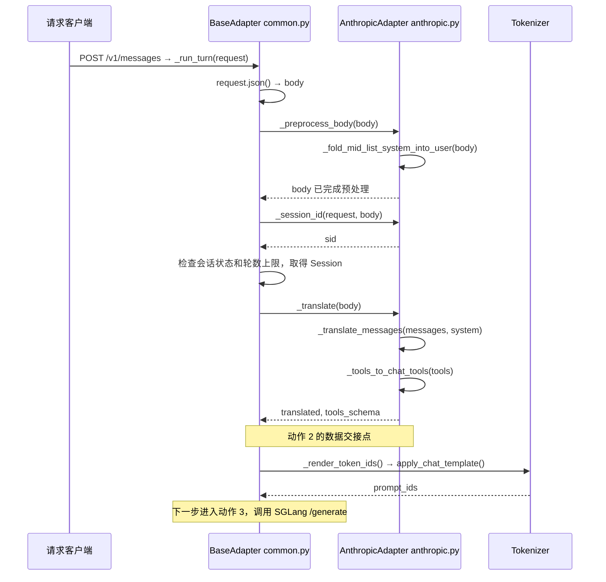

# 动作 2 请求入口和特殊分支

[上一篇 主路径和源码函数](2.主路径和源码函数.md) · [返回入口](README.md)

转换主路径清楚后，再补齐它前面的请求准备与检查。下面这些步骤在真实请求中发生得更早，放在阅读顺序后面是为了逐步增加理解范围。

## 1 请求怎样进入共享流程

**执行逻辑：** `BaseAdapter.__init__()` 创建 HTTP 应用，调用适配器的路由注册函数。`AnthropicAdapter._register_routes()` 将 `POST /v1/messages` 绑定到 `self._run_turn`，请求因此进入共享处理函数。

| 函数名 | 定义位置 | 相关调用位置 |
| --- | --- | --- |
| `BaseAdapter.__init__()` | `slime/agent/adapters/common.py:141` | 示例创建适配器：`examples/coding_agent_rl/generate.py:150` |
| `AnthropicAdapter._register_routes()` | `slime/agent/adapters/anthropic.py:48` | `slime/agent/adapters/common.py:175` |
| `BaseAdapter._run_turn()` | `slime/agent/adapters/common.py:318` | 路由绑定：`slime/agent/adapters/anthropic.py:49` |

`request.json()` 在 `slime/agent/adapters/common.py:325` 读取请求体，得到 `body`。

## 2 先处理消息列表中间的系统消息

**执行逻辑：** 某些客户端在消息列表中间插入 `role: system`。预处理将它包装为 `<system-reminder>` 文本块，并原地修改消息列表，使其适配聊天模板。

| 函数名 | 定义位置 | 调用位置 |
| --- | --- | --- |
| `AnthropicAdapter._preprocess_body()` | `slime/agent/adapters/anthropic.py:55` | `slime/agent/adapters/common.py:326` |
| `_fold_mid_list_system_into_user()` | `slime/agent/adapters/anthropic.py:291` | `slime/agent/adapters/anthropic.py:56` |
| 内部辅助函数 `_promote_to_list()` | `slime/agent/adapters/anthropic.py:309` | `slime/agent/adapters/anthropic.py:332`、`slime/agent/adapters/anthropic.py:339` |
| 内部辅助函数 `_wrap()` | `slime/agent/adapters/anthropic.py:316` | `slime/agent/adapters/anthropic.py:326` |

| 情况 | 处理 |
| --- | --- |
| 前面有用户消息 | 将提醒追加到最近的前方用户消息 |
| 前面没有，后面有用户消息 | 将提醒插入最近的后方用户消息开头 |
| 没有用户消息 | 将当前系统消息替换为含提醒块的用户消息 |

此预处理只处理列表中不在首位的系统消息。顶层 `system` 和列表首位的系统消息仍由消息转换函数处理。

输入示例：

```json
{
  "messages": [
    {
      "role": "user",
      "content": "原问题"
    },
    {
      "role": "system",
      "content": "补充提醒"
    }
  ]
}
```

经过预处理和消息转换后的 `translated`：

```json
[
  {
    "role": "user",
    "content": "原问题"
  },
  {
    "role": "user",
    "content": "<system-reminder>\n补充提醒\n</system-reminder>\n"
  }
]
```

## 3 取得会话标识

**执行逻辑：** 优先读取 `Authorization: Bearer`，其次读取 `X-Api-Key`；没有可用值时使用 `"default"`。

| 函数名 | 定义位置 | 调用位置 |
| --- | --- | --- |
| `AnthropicAdapter._session_id()` | `slime/agent/adapters/anthropic.py:52` | `slime/agent/adapters/common.py:327` |
| `_request_session_id()` | `slime/agent/adapters/anthropic.py:192` | `slime/agent/adapters/anthropic.py:53` |
| `sid_from_bearer()` | `slime/agent/adapters/common.py:396` | `slime/agent/adapters/anthropic.py:195` |

**输入 → 输出：** 请求头 → `sid`。它用于定位会话状态。

## 4 检查是否继续执行转换

**执行逻辑：** 共享流程先检查会话是否已关闭，再检查配置的轮数上限，通过后取得或创建当前会话状态。

| 检查或处理 | 具体执行点 | 结果 |
| --- | --- | --- |
| `sid in self.closed` | `slime/agent/adapters/common.py:328` | 已关闭时返回 503 |
| `BaseAdapter._check_turn_cap()` | 定义：`slime/agent/adapters/common.py:285`；调用：`slime/agent/adapters/common.py:331` | 配置了上限且已达到时返回 429；未达到时更新轮数计数 |
| `self.store.setdefault(sid, Session())` | `slime/agent/adapters/common.py:336` | 取得或创建 `Session` |

没有配置轮数上限时，`_check_turn_cap()` 直接允许继续执行。通过检查后，才到达 `slime/agent/adapters/common.py:341` 的转换与交接语句。

## 5 看完整入口的调用顺序

下面这张图同时展示动作 2 前面的准备步骤及它后面的模型输入准备。转换结果返回 Core 的位置仍是动作 2 的交接点。



## 6 Launch Agent 与动作 2 怎样关联

Agent 启动后发出的模型请求会进入 HTTP 适配器。动作 2 的转换函数接收这些请求的数据，并将其交给共享流程。

启动动作的真实调用位于 `examples/coding_agent_rl/generate.py:205`：`generate()` 调用 `HARNESS_CLS().run()`。Harness 的共享 `run()` 定义于 `slime/agent/harness/common.py:81`，在 `slime/agent/harness/common.py:104` 调用具体 Harness 的 `launch_and_wait()`。

这条启动链路归入动作 4 **Slime Core → Agent Harnesses** 的专题阅读。原图中的箭头表示职责关系；本地实现的启动调用者是外层 `generate()`。
