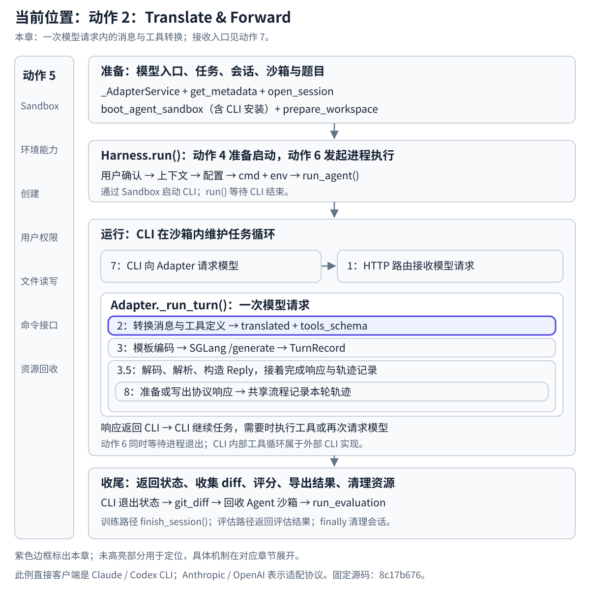

# 动作 2 Translate & Forward 渐进阅读

## 在任务生命周期中的位置

本章：一次模型请求内的消息与工具转换；接收入口见动作 7。

[](../../../../static/images/slime-lifecycle/action-2.svg)

[返回生命周期总览](../README.md#任务生命周期与原图的用途) · [放大当前位置图](../../../../static/images/slime-lifecycle/action-2.svg)


[返回架构图与源码文件对应](../README.md)

想先沿着具体请求看清每个函数之后的数据，可以从[纵向数据流](纵向数据流/README.md)开始，或直接[打开图文预览](纵向数据流/index.html)。源码位置集中在末尾供校验。

这条箭头连接 **HTTP Adapters (AnthropicAdapter, OpenAIAdapter)** 和 **Slime Core (BaseAdapter, TrajectoryManager)**。先理解它要解决什么问题，再以 Anthropic 请求为例逐步阅读源码。

## 先理解动作 2 为了什么

**动作 2 的目的是把现成 Agent 发出的模型请求，接入 Slime 自己的模型处理流程。**

例如，Claude Code 在修改代码的过程中，需要让模型决定下一步该回答什么、调用什么工具。它会按 Anthropic API 的格式提交对话和工具定义。在这里，我们希望接住这些请求，让 Slime 当前服务的模型来生成下一步决策。

这就需要一个输入衔接点：客户端使用自己的 API 格式，Slime 的共享处理流程需要消息和工具定义，随后才能按当前模型的模板准备输入。动作 2 负责完成这个衔接，把请求整理成 Core 可以继续处理的数据。

### Anthropic 格式与实际生成模型是什么关系？

**Anthropic 格式规定请求和响应怎样组织；实际由哪个模型生成，取决于请求接到哪里。**这里 Claude Code 的请求地址被配置为本地适配器，因此它发来的是 Anthropic 格式的请求，随后交由 Slime 当前服务的模型处理。

这条链路中的格式会发生变化：

```text
Claude Code 发出 Anthropic 格式的请求
    → 动作 2：整理成共享的消息列表和工具定义
    → Core：按当前模型的聊天模板编码为 token IDs
    → SGLang /generate：接收 input_ids 和采样参数，运行模型生成
    → 适配器：把生成结果封装成 Anthropic 格式的响应，返回 Claude Code
```

所以，“客户端发送 Anthropic 格式”与“后端也直接接收 Anthropic 格式”是两件事。本实现向 SGLang 的 `/generate` 发送的是 `input_ids`，需要先完成消息整理和模型模板编码。动作 2 提供整理后的消息和工具定义，后续 Core 才能完成编码与生成请求。

理解它时，可以依次回答三个问题：

| 问题 | 答案 |
| --- | --- |
| 谁需要这一步？ | 发出模型请求的 Agent，以及接收请求的 Slime 模型处理流程 |
| 为什么需要转换并交接？ | 把客户端的 API 表达方式接到 Slime 的共享输入处理方式上 |
| 完成后能够做什么？ | Core 能继续准备模型输入，并请求后端生成这一次 Agent 决策 |

完整适配链让我们能够复用 Agent 的工作流程，让它使用 Slime 服务的模型；后续还可以收集这些交互中的模型生成轨迹，用于训练。**动作 2 在这条链中的成果，是让一次 Agent 请求成为 Core 可处理的输入。**模型生成、响应返回和轨迹收集在后续步骤展开。

## 先建立最小心智模型

**`_run_turn()` 是一次模型请求的完整处理骨架，`_translate()` 是其中的输入转换步骤。**先知道每一步在整体中的位置，再展开动作 2 的细节。

```text
_run_turn()：处理一次完整的模型请求
    ├─ 读取、预处理请求
    ├─ _translate()          ← 动作 2：转换消息和工具定义，并交回共享流程
    ├─ _render_token_ids()   ← 按当前模型的模板准备输入 token IDs
    ├─ 请求 SGLang 生成
    ├─ 解码、parse_model_output()：整理生成结果
    ├─ 构造并返回 Anthropic / OpenAI 格式的响应
    └─ 记录本轮轨迹
```

图中的动作 2 位于这个骨架的输入转换与交接处。`_run_turn()` 还组织后续生成、解析、响应和记录，因此它的范围覆盖整轮请求。本章先展示全貌用于定位，再集中展开动作 2。

这里的“一轮”是一次模型请求。Agent 完成整个任务可能多次请求模型，也就多次执行 `_run_turn()`。

| 数据 | 此时只需理解的含义 |
| --- | --- |
| `body` | 客户端提交的请求，里面有消息，也可能有工具定义 |
| `translated` | 这套实现内部统一使用的消息列表，不是一个新的对外 HTTP API |
| `tools_schema` | 转换后的工具定义；没有有效工具时为 `None` |

## 用一条普通消息看转换

请求中的用户消息：

```json
{
  "role": "user",
  "content": [
    {
      "type": "text",
      "text": "你好"
    }
  ]
}
```

转换后的用户消息：

```json
{
  "role": "user",
  "content": "你好"
}
```

这里保留了 `role: user`，把 Anthropic 的文本块整理成 `content` 字符串。这个例子没有工具，因此第二份输出 `tools_schema` 为 `None`。

## 认出最短的真实调用链

```text
BaseAdapter._run_turn()
    → AnthropicAdapter._translate(body)
    → 返回 translated、tools_schema
    → BaseAdapter._run_turn() 接收结果并继续处理
```

图中的 Adapter 和 Core 是职责分组。实际请求进入共享的 `_run_turn()`，它调用适配器的转换函数并接收返回值。

## 按这个顺序继续阅读

| 阅读顺序 | 文档 | 这一层要理解什么 |
| --- | --- | --- |
| 1 | [消息和工具转换](1.消息和工具转换.md) | 在普通文本基础上，每次增加一种输入，观察输出怎样变化 |
| 2 | [主路径和源码函数](2.主路径和源码函数.md) | 把转换与交接对应到实际函数、文件和行号 |
| 3 | [请求入口和特殊分支](3.请求入口和特殊分支.md) | 主路径清楚后，再看路由、预处理、会话标识和拒绝条件 |

所有源码路径均相对于 Slime 仓库根目录。

## 动作 2 的说明到哪里结束

这篇会接到真实的 Core 接收点：`_run_turn()` 调用转换函数，并接收 `translated` 与 `tools_schema`。下一步 Core 用这两份数据准备模型输入。

继续按输入输出阅读，可进入[动作 3 Generate Tokens 纵向数据流](<../3.Generate Tokens/README.md>)，从模型模板编码读到 SGLang 返回本轮生成记录。

采样、SGLang 请求、生成结果解析、响应和轨迹管理放在 [Slime Core 完整请求流程](<../Slime Core 完整请求流程.md>)，可以在动作 2 读完之后继续看。

[`Launch Agent` 的启动链路](<../4.Launch Agent/README.md>)属于动作 4。实际示例由外层 `generate()` 调用 Harness 启动 Agent；Agent 发出的模型请求会进入适配器。原架构图表达职责关系，箭头编号用于定位动作，各动作的实际调用顺序以源码为准。
