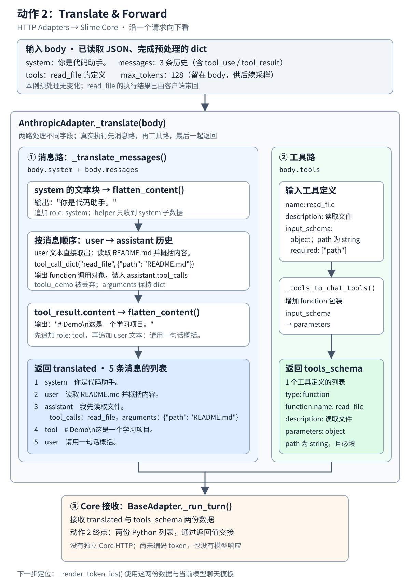

# Translate & Forward 纵向数据流



这张局部图只展开 **HTTP Adapters → Slime Core** 的动作 2：把 Anthropic 请求里的消息和工具定义，整理成共享流程能继续使用的两份数据。顺着图向下看，下面所有输入和输出都来自[同一个完整示例](示例.json)。

图上的两路表示数据分工。真实执行时，`_translate()` **先完成消息转换，再转换工具定义**，最后一起返回。

[下一站 动作 3 Generate Tokens](<../../3.Generate Tokens/README.md>)：继续使用这两份结果，查看模型输入与生成记录。

## 1. 入口：手里已经有 body

此时 `BaseAdapter._run_turn()` 已读取请求 JSON 并完成预处理，`body` 是 Python `dict`。本例没有消息列表中途插入的 system 消息，预处理没有改变它。

| body 中的字段 | 这一步的去向 |
| --- | --- |
| `system` + `messages` | 进入 `_translate_messages()`，成为 `translated` |
| `tools` | 单独进入 `_tools_to_chat_tools()`，成为 `tools_schema` |
| `max_tokens: 128` | 留在 `body` 中，供后续采样参数使用 |

<details>
<summary>展开完整输入 body：下面各步骤一直使用这一份请求</summary>

```json
{
  "system": [
    {
      "type": "text",
      "text": "你是代码助手。"
    }
  ],
  "messages": [
    {
      "role": "user",
      "content": [
        {
          "type": "text",
          "text": "读取 README.md 并概括内容。"
        }
      ]
    },
    {
      "role": "assistant",
      "content": [
        {
          "type": "text",
          "text": "我先读取文件。"
        },
        {
          "type": "tool_use",
          "id": "toolu_demo",
          "name": "read_file",
          "input": {
            "path": "README.md"
          }
        }
      ]
    },
    {
      "role": "user",
      "content": [
        {
          "type": "tool_result",
          "tool_use_id": "toolu_demo",
          "content": [
            {
              "type": "text",
              "text": "# Demo\n这是一个学习项目。"
            }
          ]
        },
        {
          "type": "text",
          "text": "请用一句话概括。"
        }
      ]
    }
  ],
  "tools": [
    {
      "name": "read_file",
      "description": "读取文件",
      "input_schema": {
        "type": "object",
        "properties": {
          "path": {
            "type": "string"
          }
        },
        "required": [
          "path"
        ]
      }
    }
  ],
  "max_tokens": 128
}
```

</details>

`read_file` 已经在客户端执行过。本次请求把历史 `tool_use` 和对应 `tool_result` 一起带回来；这里做的是历史记录规范化。工具定义则告诉后续模型：本轮仍然可以选择调用 `read_file`。

## 2. 消息路：_translate_messages() 按历史顺序处理

它收到上面 `body.messages` 的三条消息，以及 `body.system`。辅助函数处理的是其中的局部值，不会让整个 `body` 依次穿过所有 helper。

### 2.1 system 文本块 → 一条 system 消息

`flatten_content()` 收到的是 `body.system`：

```json
[
  {
    "type": "text",
    "text": "你是代码助手。"
  }
]
```

实际输出是一段字符串：

```json
"你是代码助手。"
```

`_translate_messages()` 把这段输出放进第一条消息：

```json
{
  "role": "system",
  "content": "你是代码助手。"
}
```

### 2.2 第一条 user 文本块 → 一条 user 消息

输入：

```json
{
  "role": "user",
  "content": [
    {
      "type": "text",
      "text": "读取 README.md 并概括内容。"
    }
  ]
}
```

实际输出：

```json
{
  "role": "user",
  "content": "读取 README.md 并概括内容。"
}
```

本例的 `content` 已经是文本块列表，转换函数直接取块中的 `text`。这里没有调用 `flatten_content()`。

### 2.3 assistant 历史 → 文本 + tool_calls

这一条消息的输入：

```json
{
  "role": "assistant",
  "content": [
    {
      "type": "text",
      "text": "我先读取文件。"
    },
    {
      "type": "tool_use",
      "id": "toolu_demo",
      "name": "read_file",
      "input": {
        "path": "README.md"
      }
    }
  ]
}
```

文本块提供 `content: "我先读取文件。"`。处理 `tool_use` 块时，转换函数只把工具名和输入参数交给 `tool_call_dict()`：

```json
{
  "name": "read_file",
  "arguments": {
    "path": "README.md"
  }
}
```

上面两项对应实际调用的两个参数：`name = "read_file"`，`arguments = {"path": "README.md"}`。helper 的实际输出是：

```json
{
  "type": "function",
  "function": {
    "name": "read_file",
    "arguments": {
      "path": "README.md"
    }
  }
}
```

这个对象装入 `tool_calls` 列表后，整条 assistant 消息成为：

```json
{
  "role": "assistant",
  "content": "我先读取文件。",
  "tool_calls": [
    {
      "type": "function",
      "function": {
        "name": "read_file",
        "arguments": {
          "path": "README.md"
        }
      }
    }
  ]
}
```

注意两个具体变化：`id: "toolu_demo"` 被丢弃；`input` 改为 `arguments`，其值仍然是 Python `dict`，没有变成 JSON 字符串。

### 2.4 第二条 user 历史 → 一条 tool + 一条 user

这一条输入消息同时带了工具结果和后续文本：

```json
{
  "role": "user",
  "content": [
    {
      "type": "tool_result",
      "tool_use_id": "toolu_demo",
      "content": [
        {
          "type": "text",
          "text": "# Demo\n这是一个学习项目。"
        }
      ]
    },
    {
      "type": "text",
      "text": "请用一句话概括。"
    }
  ]
}
```

遇到 `tool_result` 时，`flatten_content()` 收到的是 **该块的 content**：

```json
[
  {
    "type": "text",
    "text": "# Demo\n这是一个学习项目。"
  }
]
```

实际输出：

```json
"# Demo\n这是一个学习项目。"
```

转换函数先追加一条 `role: tool` 消息，再把紧接着的文本块追加成 `role: user` 消息：

```json
[
  {
    "role": "tool",
    "content": "# Demo\n这是一个学习项目。"
  },
  {
    "role": "user",
    "content": "请用一句话概括。"
  }
]
```

因此，一条 Anthropic `user` 消息在这里拆成了两条内部消息。`tool_use_id: "toolu_demo"` 也没有进入输出。

### 2.5 消息路的完整返回值：translated

到这里，`_translate_messages()` 已按原来的历史顺序组装出 **5 条消息**。这是它返回的完整 Python 列表，用 JSON 形式展示：

```json
[
  {
    "role": "system",
    "content": "你是代码助手。"
  },
  {
    "role": "user",
    "content": "读取 README.md 并概括内容。"
  },
  {
    "role": "assistant",
    "content": "我先读取文件。",
    "tool_calls": [
      {
        "type": "function",
        "function": {
          "name": "read_file",
          "arguments": {
            "path": "README.md"
          }
        }
      }
    ]
  },
  {
    "role": "tool",
    "content": "# Demo\n这是一个学习项目。"
  },
  {
    "role": "user",
    "content": "请用一句话概括。"
  }
]
```

## 3. 工具路：_tools_to_chat_tools() 转换工具定义

消息路返回后，`_translate()` 再把 `body.tools` 交给 `_tools_to_chat_tools()`。这一支不经过上面的历史消息 helper。

完整输入：

```json
[
  {
    "name": "read_file",
    "description": "读取文件",
    "input_schema": {
      "type": "object",
      "properties": {
        "path": {
          "type": "string"
        }
      },
      "required": [
        "path"
      ]
    }
  }
]
```

实际输出 `tools_schema`：

```json
[
  {
    "type": "function",
    "function": {
      "name": "read_file",
      "description": "读取文件",
      "parameters": {
        "type": "object",
        "properties": {
          "path": {
            "type": "string"
          }
        },
        "required": [
          "path"
        ]
      }
    }
  }
]
```

`name`、`description` 和参数内容保留下来；外面增加 `type: "function"` 与 `function` 包装，`input_schema` 改名为 `parameters`。这份定义与 assistant 历史里的 `tool_calls` 是两种数据：前者声明可用工具，后者记录已经发生的调用。

## 4. 汇合：_translate() 返回，Core 接收

`AnthropicAdapter._translate(body)` 的完整输入就是第 1 步的 `body`。它返回一个二元组：

```python
(translated, tools_schema)
```

两个元素分别是上面完整展示的 **5 条消息列表** 和 **1 个工具定义列表**。本例两者都是 Python `list`；没有有效工具时，第二项才会是 `None`。

`AnthropicAdapter` 继承 `BaseAdapter`。共享的 `_run_turn()` 在同一个适配器实例上调用 `self._translate(body)`，把返回值接收到 `translated` 和 `tools_schema` 两个变量中。这就是图中“Forward”的实际交接方式：Python 函数调用与返回值，没有独立的 Core HTTP 请求。

**动作 2 到这里完成。**它的成果是两份规范化数据；此时尚未生成 token，也没有模型响应。`body.max_tokens` 仍为 `128`，并未塞进消息或工具定义里。

下一步定位到 `_render_token_ids()`：它使用两份列表和当前模型的聊天模板准备 token IDs；具体数值取决于 tokenizer 和模板，本例不虚构。

<details>
<summary>已经理解数据流后：源码位置与进一步校验</summary>

固定源码版本：`8c17b676cb57af1d17ee4402e91e9209af84b60b`。以下路径均相对于 Slime 仓库根目录；[示例](示例.json)中的输出由该版本真实函数计算。

| 要校验的事实 | 定义 / 调用位置 |
| --- | --- |
| 继承共享流程 | `slime/agent/adapters/anthropic.py:39`，`AnthropicAdapter(BaseAdapter)` |
| 读取与预处理 body | `slime/agent/adapters/common.py:325`、`:326` |
| 本例预处理不变 | `slime/agent/adapters/anthropic.py:55`；`_fold_mid_list_system_into_user` 定义 `:291`，无中途 system 时返回 `False` |
| `_translate()` 先消息、后工具，再返回 | `slime/agent/adapters/anthropic.py:58`，调用 `:59`、`:60`，返回 `:61` |
| `_translate_messages()` 定义与完整返回 | `slime/agent/adapters/anthropic.py:81`、`:120` |
| system 使用 `flatten_content()` | `slime/agent/adapters/anthropic.py:85` |
| assistant 使用 `tool_call_dict()` | `slime/agent/adapters/anthropic.py:111` |
| tool_result 使用 `flatten_content()` | `slime/agent/adapters/anthropic.py:94` |
| `flatten_content()` 定义 | `slime/agent/adapters/common.py:76` |
| `tool_call_dict()` 定义，arguments 保持 dict | `slime/agent/adapters/common.py:110` |
| `_tools_to_chat_tools()` 定义，input_schema → parameters | `slime/agent/adapters/anthropic.py:123`、`:137` |
| Core 调用转换并接收两份数据 | `slime/agent/adapters/common.py:341` |
| 下一步渲染 token IDs | `slime/agent/adapters/common.py:342`；定义 `:58` |
| 后续采样读取 max_tokens | `slime/agent/adapters/anthropic.py:45`；`slime/agent/adapters/common.py:425` |

Core 接收点的实际语句（`common.py:341`）：

```python
translated, tools_schema = self._translate(body)
```

需要补看更广的上下文时，可读[原动作 2 入口](../README.md)、[原消息和工具转换](../1.消息和工具转换.md)、[原主路径和源码函数](../2.主路径和源码函数.md)。

</details>
