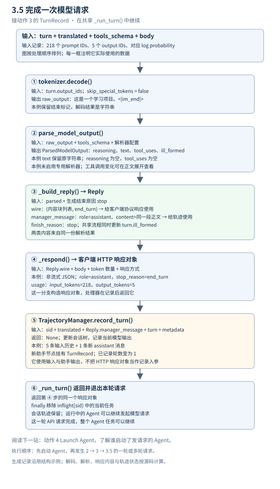

# 3.5 完成一次模型请求 纵向数据流



[返回原架构图](../README.md) · [上一站 动作 3](<../3.Generate Tokens/README.md>) · [下一站 Launch Agent](<../4.Launch Agent/README.md>) · [打开图文预览](index.html)

**动作 3 交回 `TurnRecord`；本篇接着把输出 token 解码、解析并封装为客户端响应，再保存本轮轨迹，让 `_run_turn()` 完成这一次请求。** `3.5` 是补充阅读编号，用来连接生成与返回路径；原架构图仍保留原来的 8 条箭头。

沿用动作 3 的同一份示例：218 个输入 token，5 个输出 token。生成记录和 log probability 仍是上一站的结构演示数据；本篇的解码、解析、Reply 构造和轨迹记录由本地真实源码计算。示例采用 Anthropic 协议、非流式响应，专用工具与推理解析器配置均为 `None`，可选调试回调未启用。

主路径有两个去向：**客户端拿到协议响应，轨迹管理器保存输入与模型输出。** `Reply` 会同时准备这两类数据，后续函数分别使用它们。[完整示例](示例.json)保留每一步的快照。

## 1 接住动作 3 的生成记录

**输入：** 共享 `_run_turn()` 中的 `turn`，以及仍然持有的 `translated`、`tools_schema` 和原始 `body`。

生成记录的输出部分如下。`prompt_ids` 仍是上一站完整的 218 项列表，放在完整示例中。

```json
{
  "output_ids": [
    105464,
    100134,
    73345,
    1773,
    151645
  ],
  "finish_reason": "stop",
  "output_log_probs": [
    -0.12,
    -0.08,
    -0.06,
    -0.03,
    -0.01
  ],
  "ill_formed": false
}
```

| 数据 | 这里的去向 |
| --- | --- |
| `turn.output_ids` | 解码为 `raw_output` |
| `tools_schema` 与解析器配置 | 帮助识别正文中的工具调用与推理内容 |
| `turn.finish_reason` | 帮助构造协议结束原因 |
| `translated`、本轮助手消息与更新后的 `turn` | 交给轨迹管理器 |
| 原始 `body` | 用于响应方式及协议字段；本例选择非流式响应 |

<details>
<summary>展开从动作 3 接收到的完整 TurnRecord</summary>

```json
{
  "prompt_ids": [
    151644,
    8948,
    198,
    105043,
    46100,
    110498,
    3407,
    2,
    13852,
    271,
    2610,
    1231,
    1618,
    825,
    476,
    803,
    5746,
    311,
    7789,
    448,
    279,
    1196,
    3239,
    382,
    2610,
    525,
    3897,
    448,
    729,
    32628,
    2878,
    366,
    15918,
    1472,
    15918,
    29,
    11874,
    9492,
    510,
    27,
    15918,
    397,
    4913,
    1313,
    788,
    330,
    1688,
    497,
    330,
    1688,
    788,
    5212,
    606,
    788,
    330,
    878,
    2458,
    497,
    330,
    4684,
    788,
    330,
    57553,
    18158,
    26898,
    497,
    330,
    13786,
    788,
    5212,
    1313,
    788,
    330,
    1700,
    497,
    330,
    13193,
    788,
    5212,
    2343,
    788,
    5212,
    1313,
    788,
    330,
    917,
    9207,
    2137,
    330,
    6279,
    788,
    4383,
    2343,
    1341,
    3417,
    532,
    522,
    15918,
    1339,
    2461,
    1817,
    729,
    1618,
    11,
    470,
    264,
    2951,
    1633,
    448,
    729,
    829,
    323,
    5977,
    2878,
    220,
    151657,
    151658,
    11874,
    9492,
    510,
    151657,
    198,
    4913,
    606,
    788,
    366,
    1688,
    11494,
    8066,
    330,
    16370,
    788,
    366,
    2116,
    56080,
    40432,
    31296,
    151658,
    151645,
    198,
    151644,
    872,
    198,
    57553,
    18158,
    61945,
    21324,
    74577,
    114,
    109193,
    43815,
    1773,
    151645,
    198,
    151644,
    77091,
    198,
    35946,
    60726,
    57553,
    18158,
    26898,
    8997,
    151657,
    198,
    4913,
    606,
    788,
    330,
    878,
    2458,
    497,
    330,
    16370,
    788,
    5212,
    2343,
    788,
    330,
    54675,
    21324,
    95642,
    151658,
    151645,
    198,
    151644,
    872,
    198,
    27,
    14172,
    9655,
    397,
    2,
    28523,
    198,
    105464,
    100134,
    73345,
    8997,
    522,
    14172,
    9655,
    29,
    151645,
    198,
    151644,
    872,
    198,
    14880,
    11622,
    105321,
    109193,
    1773,
    151645,
    198,
    151644,
    77091,
    198
  ],
  "output_ids": [
    105464,
    100134,
    73345,
    1773,
    151645
  ],
  "finish_reason": "stop",
  "output_log_probs": [
    -0.12,
    -0.08,
    -0.06,
    -0.03,
    -0.01
  ],
  "ill_formed": false
}
```

</details>

## 2 解码 输出 token 变成 raw_output

共享流程调用 `tokenizer.decode()`，参数为 `skip_special_tokens=False`。

**输入：**

```json
[
  105464,
  100134,
  73345,
  1773,
  151645
]
```

**输出：** 一个字符串 `raw_output`：

```json
"这是一个学习项目。<|im_end|>"
```

这一步恢复 token 对应的文本，还没有分离正文和工具调用。本例的最后一个 ID `151645` 对应 `<|im_end|>`；因为保留特殊 token，它会出现在解码结果中。

## 3 parse_model_output 分离输出的不同部分

**输入：** 上面的 `raw_output`、上一站的 `tools_schema`，以及解析器配置。本例配置如下：

```json
{
  "tool_parser_name": null,
  "reasoning_parser_name": null
}
```

**输出：** `ParsedModelOutput` 对象，下面用 JSON 展示字段：

```json
{
  "reasoning": "",
  "text": "这是一个学习项目。<|im_end|>",
  "tool_uses": [],
  "ill_formed": false
}
```

| 字段 | 本例结果 | 含义 |
| --- | --- | --- |
| `reasoning` | 空字符串 | 本例没有解析出推理内容 |
| `text` | 解码后的这段文本 | 给后续响应构造使用的正文 |
| `tool_uses` | 空列表 | 本轮没有解析出工具调用 |
| `ill_formed` | `false` | 本例没有标记工具参数格式异常 |

本例未启用专用解析器，文本中也没有回退解析器能识别的工具调用。因此 `text` 保留了 `<|im_end|>`。**解码与解析承担不同职责，调用解析函数并不保证所有模型标记都会被移除。** 这里保留源码的实际输出，不手工删改示例。

<details>
<summary>再看一个小对照 有工具调用时 ParsedModelOutput 怎样变化</summary>

下面是另一个构造的输出文本，仅用于观察同一函数如何分离工具调用。它使用本实现的 XML 回退格式，仍然提供同一个 `read_file` 工具定义。

输入 `raw_output`：

```json
"我先读取文件。<tool_call><function=read_file><parameter=path>README.md</parameter></function></tool_call>"
```

真实函数输出：

```json
{
  "reasoning": "",
  "text": "我先读取文件。",
  "tool_uses": [
    {
      "name": "read_file",
      "input": {
        "path": "README.md"
      }
    }
  ],
  "ill_formed": false
}
```

正文与调用已经分开：`text` 只剩“我先读取文件。”，调用信息进入 `tool_uses`。这里仅识别和描述调用，实际执行工具的是客户端 Agent。

专用 SGLang 推理与工具解析器的配置、格式分支及异常处理，可以在理解这一契约后继续展开。

</details>

## 4 _build_reply 同时准备协议内容与轨迹消息

**输入：** `parsed`、生成结束原因 `stop`，以及共享流程传入的消息和工具定义。这个 Anthropic 构造函数根据解析结果和结束原因组织回复内容。

**输出：** 一个 `Reply` 对象。字段如下；其中 `wire` 在 Python 中是 `(blocks, stop_reason)` 二元组，用 JSON 展示时成为数组。

```json
{
  "manager_message": {
    "role": "assistant",
    "content": "这是一个学习项目。<|im_end|>"
  },
  "finish_reason": "stop",
  "wire": [
    [
      {
        "type": "text",
        "text": "这是一个学习项目。<|im_end|>"
      }
    ],
    "end_turn"
  ]
}
```

| Reply 字段 | 谁使用 | 本例表达什么 |
| --- | --- | --- |
| `wire` 的第 1 项 `blocks` | `_respond()` | Anthropic 内容块列表 |
| `wire` 的第 2 项 `stop_reason` | `_respond()` | `end_turn`，用于客户端协议 |
| `manager_message` | `record_turn()` | 统一的 `role: assistant` 消息 |
| `finish_reason` | Reply 中的内部结束标记 | 本例为 `stop`；这个版本的后续记录仍使用 `turn.finish_reason` |

客户端的内容块和内部助手消息描述同一段内容，但结构不同；协议结束原因 `end_turn` 和生成结束类型 `stop` 也分别用于不同位置。此版本的 `_run_turn()` 后续使用 `reply.wire` 和 `reply.manager_message`，没有读取 `reply.finish_reason`；轨迹记录中的结束原因来自 `turn`。

共享流程接着用 `parsed.ill_formed` 更新本轮 `TurnRecord`。本例为 `false`，所以记录字段与动作 3 相同；格式异常时这一步可以改变记录中的标记。

<details>
<summary>补充工具调用例子的 Reply 对照</summary>

前面解析出的 `read_file` 调用会成为协议的 `tool_use` 内容块，并成为内部助手消息的 `tool_calls`。

```json
{
  "manager_message": {
    "role": "assistant",
    "content": "我先读取文件。",
    "tool_calls": [
      {
        "type": "function",
        "function": {
          "name": "read_file",
          "arguments": {
            "path": "README.md"
          }
        }
      }
    ]
  },
  "finish_reason": "tool_calls",
  "wire": [
    [
      {
        "type": "text",
        "text": "我先读取文件。"
      },
      {
        "type": "tool_use",
        "id": "toolu_aaaaaaaaaaaaaaaa",
        "name": "read_file",
        "input": {
          "path": "README.md"
        }
      }
    ],
    "tool_use"
  ]
}
```

示例中的工具调用 ID 已固定，便于逐项对照；真实运行会生成新的 ID。ID 保留在客户端协议块中，内部规范化的 `tool_calls` 只保留名称和参数。协议的 `stop_reason` 变成 `tool_use`，内部 `finish_reason` 变成 `tool_calls`。

</details>

## 5 _respond 构造客户端 HTTP 响应

**输入：** `Reply.wire`、原始 `body`、输入和输出 token 数量，以及响应方式。

本例 `body.stream` 没有设为 `true`，请求头也没有要求事件流，因此走非流式分支：先 `_render_response()` 构造协议字典，再用 `web.json_response()` 构造响应对象。

**输出：** HTTP 响应对象，协议 body 的完整内容是：

```json
{
  "id": "msg_aaaaaaaaaaaaaaaaaaaaaaaa",
  "type": "message",
  "role": "assistant",
  "model": "slime-actor",
  "content": [
    {
      "type": "text",
      "text": "这是一个学习项目。<|im_end|>"
    }
  ],
  "stop_reason": "end_turn",
  "stop_sequence": null,
  "usage": {
    "input_tokens": 218,
    "output_tokens": 5
  }
}
```

本例的状态为 `200`，内容类型为 `application/json`。`usage` 中的 `218` 和 `5` 来自本轮输入、输出 ID 列表的长度。请求没有指定 `model` 字段，所以响应采用源码默认值 `slime-actor`；实际服务的模型配置和上一站使用的 tokenizer 是另一层信息。

响应 ID 为便于对照而固定。协议 body 由真实构造函数计算，示例用本地对象承载 HTTP 响应，没有启动网络服务。

**此时 `_respond()` 已返回响应对象，主路径接着记录轨迹。** 对于本例的非流式分支，最终由 HTTP 处理器返回这个对象；流式分支会在 `_respond()` 内写出事件。读主路径时先保持这两种情况的区别，事件格式可以以后展开。

## 6 record_turn 保存本轮输入与模型输出

**输入：**

| 参数 | 本例数据 |
| --- | --- |
| `sid` | `demo-session` |
| `prompt_messages` | 动作 2 的完整 5 条 `translated` 消息 |
| `response_message` | 上面 `Reply.manager_message` |
| `turn` | 包含输入 ID、输出 ID、log probability 和格式标记的本轮记录 |
| `metadata` | `{"sid": "demo-session"}` |

本例从一个尚未记录任何交互的会话树开始；请求自带的历史消息也会接入树中。

**函数返回值：** Python `None`。变化发生在 `TrajectoryManager` 的会话状态里。

记录前的状态：

```json
{
  "has_session": false,
  "turn_count": 0,
  "paths": []
}
```

记录后的状态摘要如下。这是为了阅读而提取的观察视图，不是 `record_turn()` 的返回值：

```json
{
  "has_session": true,
  "turn_count": 1,
  "path_roles": [
    "system",
    "user",
    "assistant",
    "tool",
    "user",
    "assistant"
  ],
  "last_message": {
    "role": "assistant",
    "content": "这是一个学习项目。<|im_end|>"
  },
  "last_node_has_turn": true
}
```

本例形成一条消息路径，其中前 5 条来自输入，第 6 条是本轮输出：

| 路径位置 | 角色 | 来源 | 是否挂有生成记录 |
| --- | --- | --- | --- |
| 1 | `system` | 请求带来的历史消息 | 无 |
| 2 | `user` | 请求带来的历史消息 | 无 |
| 3 | `assistant` | 请求带来的历史消息 | 无 |
| 4 | `tool` | 请求带来的历史消息 | 无 |
| 5 | `user` | 请求带来的历史消息 | 无 |
| 6 | `assistant` | 本轮模型输出 | 本轮 TurnRecord |

历史里已经有一条 assistant 消息，但它来自客户端带回的历史。本次记录只给新的助手节点挂上当前 `TurnRecord`，因此会话的已记录轮数为 `1`。

<details>
<summary>展开记录后的完整路径快照</summary>

```json
{
  "has_session": true,
  "turn_count": 1,
  "paths": [
    [
      {
        "role": "system",
        "message": {
          "role": "system",
          "content": "你是代码助手。"
        },
        "has_generation_record": false,
        "turn_index": null
      },
      {
        "role": "user",
        "message": {
          "role": "user",
          "content": "读取 README.md 并概括内容。"
        },
        "has_generation_record": false,
        "turn_index": null
      },
      {
        "role": "assistant",
        "message": {
          "role": "assistant",
          "content": "我先读取文件。",
          "tool_calls": [
            {
              "type": "function",
              "function": {
                "name": "read_file",
                "arguments": {
                  "path": "README.md"
                }
              }
            }
          ]
        },
        "has_generation_record": false,
        "turn_index": null
      },
      {
        "role": "tool",
        "message": {
          "role": "tool",
          "content": "# Demo\n这是一个学习项目。"
        },
        "has_generation_record": false,
        "turn_index": null
      },
      {
        "role": "user",
        "message": {
          "role": "user",
          "content": "请用一句话概括。"
        },
        "has_generation_record": false,
        "turn_index": null
      },
      {
        "role": "assistant",
        "message": {
          "role": "assistant",
          "content": "这是一个学习项目。<|im_end|>"
        },
        "has_generation_record": true,
        "turn_index": 1
      }
    ]
  ]
}
```

完整记录入参和更新后的 `TurnRecord` 见[示例.json](示例.json)中的 `record_input`。消息节点匹配、分叉和重写合并的内部算法，留到轨迹管理专题继续展开。

</details>

这一阶段保存会话轨迹。会话结束后再导出训练样本，是另一阶段，见 [Slime Core 完整请求流程](<../Slime Core 完整请求流程.md>)的会话结束部分。

## 7 _run_turn 返回响应并结束这一次请求

轨迹记录完成后，共享处理器返回第 5 节构造的同一个响应对象；退出时从 `inflight[sid]` 中移除当前任务。

本例退出后的观察结果：

```json
{
  "returned_same_response_object": true,
  "inflight_session_key_exists": true,
  "inflight_task_count": 0,
  "session_trajectory_retained": true
}
```

`inflight` 仍有这个会话的空任务集合，但当前请求已经不在其中。会话轨迹继续保留，Agent 可以发起下一次请求。本轮请求完成不等于整个 Agent 任务结束。

## 接回 Launch Agent 的阅读位置

接下来可以读 [动作 4 Launch Agent](<../4.Launch Agent/README.md>)，看谁启动了会持续请求模型的 Agent。`2 → 3 → 3.5 → 4` 是学习顺序；实际执行时先启动 Agent，再发生一轮或多轮请求：

```text
Launch Agent
    -> Agent makes an API request
    -> Translate & Forward
    -> Generate Tokens
    -> Decode / Parse / Respond / Record
    -> Agent continues
```

`_run_turn()` 处理的是上述一次 API 请求。Harness 启动、沙箱管理以及 CLI 的运行属于外层 Agent 生命周期。

<details>
<summary>末尾校验 源码定义 调用顺序与示例来源</summary>

源码版本：`8c17b676cb57af1d17ee4402e91e9209af84b60b`。路径相对于 Slime 仓库根目录。

| 步骤 | 定义位置 | 调用或关键位置 |
| --- | --- | --- |
| 本轮共享处理器 | `slime/agent/adapters/common.py:318` | 下列步骤均在这个函数内 |
| 解码输出 | tokenizer 提供 | `common.py:346`，`skip_special_tokens=False` |
| 主解析器 | `slime/agent/parsing.py:25` | `common.py:347–352` |
| 工具调用解析 | `parsing.py:59` | `parsing.py:50` |
| XML 回退解析 | `parsing.py:93` | `parsing.py:88` |
| 构造 Reply | `slime/agent/adapters/anthropic.py:63` | `common.py:353` |
| 构造协议块与内部助手消息 | `anthropic.py:147` | `anthropic.py:64` |
| 更新格式标记 | 共享处理器内部 | `common.py:354` |
| 选择响应方式 | 共享处理器内部 | `common.py:357` |
| 返回非流式响应对象 | `anthropic.py:71` | `common.py:363`；构造协议 body 的函数位于 `anthropic.py:198` |
| 可选调试回调 | `common.py:308` | `common.py:376`；本例未启用 |
| 记录会话轨迹 | `slime/agent/trajectory.py:283` | `common.py:384–390` |
| 返回响应、移除本轮任务 | 共享处理器内部 | `common.py:391`、`:393` |
| 外层启动 Harness | `examples/coding_agent_rl/generate.py:182` | `:205` 调用 `HARNESS_CLS().run()` |

关键交接语句：

```python
raw_output = tok.decode(turn.output_ids, skip_special_tokens=False) if turn.output_ids else ""
parsed = parse_model_output(raw_output, tools_schema=tools_schema,
                            tool_parser_name=self.tool_parser,
                            reasoning_parser_name=self.reasoning_parser)
reply = self._build_reply(parsed, turn.finish_reason, translated, tools_schema)
turn = dataclasses.replace(turn, ill_formed=parsed.ill_formed)
response = await self._respond(request, body, reply, in_tok, out_tok, stream)
self.manager.record_turn(sid, turn=turn, prompt_messages=translated,
                         response_message=reply.manager_message, metadata={"sid": sid})
return response
```

本例用上一站缓存的 Qwen2.5 tokenizer 实际解码。执行真实 `_run_turn()` 时，用动作 3 的记录代替网络生成返回；本地响应对象替代 aiohttp 的响应工厂。主解析函数、Anthropic Reply 和协议 body 构造、轨迹管理方法均按原始源码执行。完整调用顺序、配置、状态和补充工具样例见[示例.json](示例.json)。

本篇保持正常成功请求的主路径。客户端断连、取消请求、流式事件以及专用解析器的具体分支，放在需要时深入阅读。

</details>
