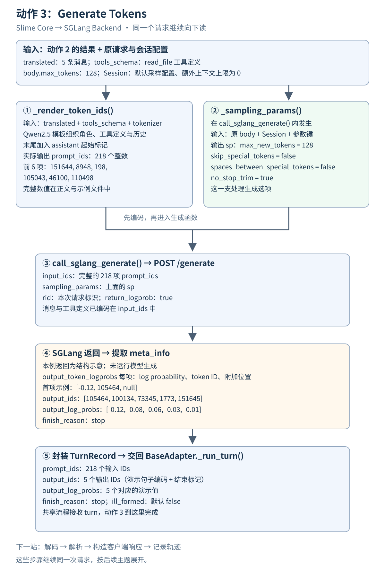

# 动作 3 Generate Tokens 纵向数据流



[返回原架构图](../README.md) · [上一站 动作 2 纵向数据流](<../2.Translate & Forward/纵向数据流/README.md>) · [下一站 3.5 完成一次模型请求](<../3.5.完成一次模型请求/README.md>) · [打开图文预览](index.html)

**动作 2 交出了消息列表和工具定义；动作 3 把它们编码为模型输入，再向 SGLang 请求生成，最后把结果整理成一份 `TurnRecord`。** 本篇对应原图 **Slime Core → SGLang Backend / Generate Tokens**，读到生成记录交回共享 `_run_turn()` 为止。

仍然沿用“读取 README.md，再用一句话概括”的请求。消息和工具定义走模板编码这条支路；原 `body` 中的 `max_tokens: 128` 与会话配置走采样参数这条支路。它们汇合后才发出生成请求。

本例用 **Qwen2.5-0.5B-Instruct 的本地 tokenizer** 实际编码，得到 **218 个输入 token IDs**。这只是固定阅读示例使用的 tokenizer；运行时使用 `args.hf_checkpoint` 加载的当前模型 tokenizer。**SGLang 返回数据和其中的 log probability 是构造的结构示例，未运行模型生成。** 输出 token IDs 来自同一 tokenizer 对演示句子的编码，后续提取与封装按真实源码执行。[完整示例](示例.json)保留每一步的数据。

## 1 接住动作 2 的两份结果

此时共享流程仍持有原始 `body`，并已收到 `translated` 和 `tools_schema`。本例还有一个默认会话配置：`sampling_defaults` 为空，`max_context_tokens` 为 `0`，表示本例不启用额外的会话上下文上限。

| 此时的数据 | 下一步交给谁 | 最小理解 |
| --- | --- | --- |
| `translated` | `_render_token_ids()` | 5 条按历史顺序排列的消息 |
| `tools_schema` | `_render_token_ids()` | 1 个可用工具的定义 |
| 原始 `body` | `call_sglang_generate()` 内的 `_sampling_params()` | 本例读取 `max_tokens: 128` |
| 当前 `Session` | `call_sglang_generate()` | 提供默认采样参数和上下文预算 |

<details>
<summary>展开消息列表与工具定义的完整输入</summary>

`translated`：

```json
[
  {
    "role": "system",
    "content": "你是代码助手。"
  },
  {
    "role": "user",
    "content": "读取 README.md 并概括内容。"
  },
  {
    "role": "assistant",
    "content": "我先读取文件。",
    "tool_calls": [
      {
        "type": "function",
        "function": {
          "name": "read_file",
          "arguments": {
            "path": "README.md"
          }
        }
      }
    ]
  },
  {
    "role": "tool",
    "content": "# Demo\n这是一个学习项目。"
  },
  {
    "role": "user",
    "content": "请用一句话概括。"
  }
]
```

`tools_schema`：

```json
[
  {
    "type": "function",
    "function": {
      "name": "read_file",
      "description": "读取文件",
      "parameters": {
        "type": "object",
        "properties": {
          "path": {
            "type": "string"
          }
        },
        "required": [
          "path"
        ]
      }
    }
  }
]
```

原始 `body` 与上一站相同，见[动作 2 示例](<../2.Translate & Forward/纵向数据流/示例.json>)。这一次的转换并没有把 `max_tokens` 放入消息列表。

</details>

## 2 模板编码 _render_token_ids

**输入：** 上面的消息列表、工具定义、当前 tokenizer，以及 `add_generation_prompt=True`。

**输出：** `prompt_ids`，一个 Python 整数列表，本例长度为 **218**。

聊天模板决定每个角色如何分隔、工具定义怎样嵌入、历史工具调用怎样表示，以及下一条 assistant 内容从哪里开始。tokenizer 将这份模型输入编码成整数 ID。

### 2.1 先认出模板组织后的内容

下面是本例同一聊天模板实际生成的文本。为了观察内容，额外用 `tokenize=False` 查看；真实 `_render_token_ids()` 调用使用 `tokenize=True`，直接取得编码结果。

<details>
<summary>展开完整模型输入文本</summary>

```text
<|im_start|>system
你是代码助手。

# Tools

You may call one or more functions to assist with the user query.

You are provided with function signatures within <tools></tools> XML tags:
<tools>
{"type": "function", "function": {"name": "read_file", "description": "读取文件", "parameters": {"type": "object", "properties": {"path": {"type": "string"}}, "required": ["path"]}}}
</tools>

For each function call, return a json object with function name and arguments within <tool_call></tool_call> XML tags:
<tool_call>
{"name": <function-name>, "arguments": <args-json-object>}
</tool_call><|im_end|>
<|im_start|>user
读取 README.md 并概括内容。<|im_end|>
<|im_start|>assistant
我先读取文件。
<tool_call>
{"name": "read_file", "arguments": {"path": "README.md"}}
</tool_call><|im_end|>
<|im_start|>user
<tool_response>
# Demo
这是一个学习项目。
</tool_response><|im_end|>
<|im_start|>user
请用一句话概括。<|im_end|>
<|im_start|>assistant
```

原文件：[模型输入.txt](模型输入.txt)。文件保留结尾的真实换行。

</details>

| 请求里的内容 | 在这个模型模板中的样子 |
| --- | --- |
| `role: system` | 带 system 角色边界的文本 |
| `tools_schema` | system 内容中的 `<tools>` 工具定义 |
| assistant 历史里的 `tool_calls` | `<tool_call>` 内的名称与参数 |
| `role: tool` 的文件内容 | `<tool_response>` 包装的工具结果 |
| `add_generation_prompt=True` | 在末尾加入 assistant 起始标记，让模型接着写下一条助手内容 |

这些标记属于本例固定的模型模板。适配器交出的字典经由模板变成模型输入；模型生成的是在这个输入之后的续写。

### 2.2 函数之后得到完整 prompt_ids

下面是实际编码结果，共 **218 个整数**，按 16 项换行展示，数值与顺序完整保留：

```json
[
  151644, 8948, 198, 105043, 46100, 110498, 3407, 2, 13852, 271, 2610, 1231, 1618, 825, 476, 803,
  5746, 311, 7789, 448, 279, 1196, 3239, 382, 2610, 525, 3897, 448, 729, 32628, 2878, 366,
  15918, 1472, 15918, 29, 11874, 9492, 510, 27, 15918, 397, 4913, 1313, 788, 330, 1688, 497,
  330, 1688, 788, 5212, 606, 788, 330, 878, 2458, 497, 330, 4684, 788, 330, 57553, 18158,
  26898, 497, 330, 13786, 788, 5212, 1313, 788, 330, 1700, 497, 330, 13193, 788, 5212, 2343,
  788, 5212, 1313, 788, 330, 917, 9207, 2137, 330, 6279, 788, 4383, 2343, 1341, 3417, 532,
  522, 15918, 1339, 2461, 1817, 729, 1618, 11, 470, 264, 2951, 1633, 448, 729, 829, 323,
  5977, 2878, 220, 151657, 151658, 11874, 9492, 510, 151657, 198, 4913, 606, 788, 366, 1688, 11494,
  8066, 330, 16370, 788, 366, 2116, 56080, 40432, 31296, 151658, 151645, 198, 151644, 872, 198, 57553,
  18158, 61945, 21324, 74577, 114, 109193, 43815, 1773, 151645, 198, 151644, 77091, 198, 35946, 60726, 57553,
  18158, 26898, 8997, 151657, 198, 4913, 606, 788, 330, 878, 2458, 497, 330, 16370, 788, 5212,
  2343, 788, 330, 54675, 21324, 95642, 151658, 151645, 198, 151644, 872, 198, 27, 14172, 9655, 397,
  2, 28523, 198, 105464, 100134, 73345, 8997, 522, 14172, 9655, 29, 151645, 198, 151644, 872, 198,
  14880, 11622, 105321, 109193, 1773, 151645, 198, 151644, 77091, 198
]
```

消息和工具定义已经组织在这份编码里。后端生成请求使用这些 `input_ids`；本实现这一步没有再把 Anthropic 原始消息和 `tools` 原样发给后端。

## 3 进入生成函数 先整理采样参数

`_run_turn()` 拿到 `prompt_ids` 后进入 `call_sglang_generate()`。该函数内部先调用 `_sampling_params()`。本节与后面两节都在这一次生成函数调用内部发生。

**输入：** 当前 `Session`、完整原始 `body`，以及 AnthropicAdapter 的参数键配置。本例相关值如下；这段展示对象属性及请求中会读取的字段：

```json
{
  "session": {
    "sampling_defaults": {},
    "max_context_tokens": 0
  },
  "body_field_used": {
    "max_tokens": 128
  },
  "adapter_keys": {
    "max_token_keys": [
      "max_tokens"
    ],
    "stop_keys": [
      "stop_sequences"
    ]
  }
}
```

**输出：** 采样参数字典 `sp`：

```json
{
  "skip_special_tokens": false,
  "spaces_between_special_tokens": false,
  "no_stop_trim": true,
  "max_new_tokens": 128
}
```

`max_tokens: 128` 成为 `max_new_tokens: 128`，限制本轮最多生成多少新 token。其余三个布尔值来自共享流程的默认参数，控制返回文本对特殊 token 和停止标记的处理；先认出它们属于生成选项即可。

本例没有额外会话默认参数，额外上下文上限也未启用，因此这里得到的 `sp` 会直接进入请求。实际配置了上下文上限时，生成函数会继续按剩余预算调整最大生成长度。

## 4 同一生成函数 发出 SGLang 请求

现在两条支路汇合：`prompt_ids` 提供模型输入，`sp` 提供生成选项。

**输入：** 上面的 `prompt_ids` 和 `sp`，再加请求标识 `rid` 与 `return_logprob=True`。

**发出的数据：** 向 SGLang 的 `/generate` 发送 POST 请求。本例的地址、请求标识和会话标识仅用于展示结构。

| 请求部分 | 本例内容 | 用途 |
| --- | --- | --- |
| URL | `http://sglang.example.invalid:30000/generate` | 示例地址，真实运行使用 `adapter.sglang_url` |
| `input_ids` | 第 2 节的完整 218 项列表 | 模型接收的输入 |
| `sampling_params` | 第 3 节的完整 `sp` | 本轮生成选项 |
| `rid` | `0123456789abcdef0123456789abcdef` | 标识这一次生成请求 |
| `return_logprob` | `true` | 要求返回输出 token 的 log probability |

<details>
<summary>展开实际源码组装出的完整请求 JSON</summary>

```json
{
  "rid": "0123456789abcdef0123456789abcdef",
  "input_ids": [
    151644,
    8948,
    198,
    105043,
    46100,
    110498,
    3407,
    2,
    13852,
    271,
    2610,
    1231,
    1618,
    825,
    476,
    803,
    5746,
    311,
    7789,
    448,
    279,
    1196,
    3239,
    382,
    2610,
    525,
    3897,
    448,
    729,
    32628,
    2878,
    366,
    15918,
    1472,
    15918,
    29,
    11874,
    9492,
    510,
    27,
    15918,
    397,
    4913,
    1313,
    788,
    330,
    1688,
    497,
    330,
    1688,
    788,
    5212,
    606,
    788,
    330,
    878,
    2458,
    497,
    330,
    4684,
    788,
    330,
    57553,
    18158,
    26898,
    497,
    330,
    13786,
    788,
    5212,
    1313,
    788,
    330,
    1700,
    497,
    330,
    13193,
    788,
    5212,
    2343,
    788,
    5212,
    1313,
    788,
    330,
    917,
    9207,
    2137,
    330,
    6279,
    788,
    4383,
    2343,
    1341,
    3417,
    532,
    522,
    15918,
    1339,
    2461,
    1817,
    729,
    1618,
    11,
    470,
    264,
    2951,
    1633,
    448,
    729,
    829,
    323,
    5977,
    2878,
    220,
    151657,
    151658,
    11874,
    9492,
    510,
    151657,
    198,
    4913,
    606,
    788,
    366,
    1688,
    11494,
    8066,
    330,
    16370,
    788,
    366,
    2116,
    56080,
    40432,
    31296,
    151658,
    151645,
    198,
    151644,
    872,
    198,
    57553,
    18158,
    61945,
    21324,
    74577,
    114,
    109193,
    43815,
    1773,
    151645,
    198,
    151644,
    77091,
    198,
    35946,
    60726,
    57553,
    18158,
    26898,
    8997,
    151657,
    198,
    4913,
    606,
    788,
    330,
    878,
    2458,
    497,
    330,
    16370,
    788,
    5212,
    2343,
    788,
    330,
    54675,
    21324,
    95642,
    151658,
    151645,
    198,
    151644,
    872,
    198,
    27,
    14172,
    9655,
    397,
    2,
    28523,
    198,
    105464,
    100134,
    73345,
    8997,
    522,
    14172,
    9655,
    29,
    151645,
    198,
    151644,
    872,
    198,
    14880,
    11622,
    105321,
    109193,
    1773,
    151645,
    198,
    151644,
    77091,
    198
  ],
  "sampling_params": {
    "skip_special_tokens": false,
    "spaces_between_special_tokens": false,
    "no_stop_trim": true,
    "max_new_tokens": 128
  },
  "return_logprob": true
}
```

本例的请求头是：

```json
{
  "X-SMG-Routing-Key": "demo-session"
}
```

`X-SMG-Routing-Key` 来自会话标识；先知道它是请求头上的路由信息即可。完整请求已保存在[示例.json](示例.json)的 `request` 中。

</details>

在这一步，模型后端根据输入 token 和生成选项产生新的 token。后端如何调度请求、管理 KV cache 和执行模型，可以在读通这次交接之后继续展开。

## 5 同一生成函数 从返回数据提取结果

**输入：** SGLang 响应中的 `meta_info`。以下是本例构造的完整响应结构，log probability 为人为选取的演示值：

```json
{
  "meta_info": {
    "output_token_logprobs": [
      [
        -0.12,
        105464,
        null
      ],
      [
        -0.08,
        100134,
        null
      ],
      [
        -0.06,
        73345,
        null
      ],
      [
        -0.03,
        1773,
        null
      ],
      [
        -0.01,
        151645,
        null
      ]
    ],
    "finish_reason": {
      "type": "stop"
    }
  }
}
```

`output_token_logprobs` 的每一项按“log probability、token ID、附加文本位置”组织。此实现只读取每项的前两个位置；本例将第三项置为 `null`。下面可以逐项对应：

| 生成位置 | 第 0 项 log probability | 第 1 项 token ID |
| --- | --- | --- |
| 1 | `-0.12` | `105464` |
| 2 | `-0.08` | `100134` |
| 3 | `-0.06` | `73345` |
| 4 | `-0.03` | `1773` |
| 5 | `-0.01` | `151645` |

**提取后的数据：**

`output_ids`：

```json
[
  105464,
  100134,
  73345,
  1773,
  151645
]
```

`output_log_probs`：

```json
[
  -0.12,
  -0.08,
  -0.06,
  -0.03,
  -0.01
]
```

`finish_reason`：

```json
"stop"
```

两份列表按位置一一对应。本例的输出 ID 是演示句子“这是一个学习项目。”的编码，再附结束标记 ID `151645`；SGLang 的结构示例据此提供 5 项记录。`stop` 表示这份示例响应的结束类型。真实内容和概率由模型生成决定。

这一步还没有解析正文或工具调用。解码与 `parse_model_output()` 是共享流程拿到 `TurnRecord` 后的下一段。

## 6 封装 TurnRecord 交回共享流程

**输入：** 本轮已有的 `prompt_ids`，以及刚提取出的 `output_ids`、`output_log_probs`、`finish_reason`。

**输出：** 一份 `TurnRecord` 对象。下面用 JSON 展示其字段；实际返回的是 Python dataclass 实例：

<details>
<summary>展开本例完整 TurnRecord 字段</summary>

```json
{
  "prompt_ids": [
    151644,
    8948,
    198,
    105043,
    46100,
    110498,
    3407,
    2,
    13852,
    271,
    2610,
    1231,
    1618,
    825,
    476,
    803,
    5746,
    311,
    7789,
    448,
    279,
    1196,
    3239,
    382,
    2610,
    525,
    3897,
    448,
    729,
    32628,
    2878,
    366,
    15918,
    1472,
    15918,
    29,
    11874,
    9492,
    510,
    27,
    15918,
    397,
    4913,
    1313,
    788,
    330,
    1688,
    497,
    330,
    1688,
    788,
    5212,
    606,
    788,
    330,
    878,
    2458,
    497,
    330,
    4684,
    788,
    330,
    57553,
    18158,
    26898,
    497,
    330,
    13786,
    788,
    5212,
    1313,
    788,
    330,
    1700,
    497,
    330,
    13193,
    788,
    5212,
    2343,
    788,
    5212,
    1313,
    788,
    330,
    917,
    9207,
    2137,
    330,
    6279,
    788,
    4383,
    2343,
    1341,
    3417,
    532,
    522,
    15918,
    1339,
    2461,
    1817,
    729,
    1618,
    11,
    470,
    264,
    2951,
    1633,
    448,
    729,
    829,
    323,
    5977,
    2878,
    220,
    151657,
    151658,
    11874,
    9492,
    510,
    151657,
    198,
    4913,
    606,
    788,
    366,
    1688,
    11494,
    8066,
    330,
    16370,
    788,
    366,
    2116,
    56080,
    40432,
    31296,
    151658,
    151645,
    198,
    151644,
    872,
    198,
    57553,
    18158,
    61945,
    21324,
    74577,
    114,
    109193,
    43815,
    1773,
    151645,
    198,
    151644,
    77091,
    198,
    35946,
    60726,
    57553,
    18158,
    26898,
    8997,
    151657,
    198,
    4913,
    606,
    788,
    330,
    878,
    2458,
    497,
    330,
    16370,
    788,
    5212,
    2343,
    788,
    330,
    54675,
    21324,
    95642,
    151658,
    151645,
    198,
    151644,
    872,
    198,
    27,
    14172,
    9655,
    397,
    2,
    28523,
    198,
    105464,
    100134,
    73345,
    8997,
    522,
    14172,
    9655,
    29,
    151645,
    198,
    151644,
    872,
    198,
    14880,
    11622,
    105321,
    109193,
    1773,
    151645,
    198,
    151644,
    77091,
    198
  ],
  "output_ids": [
    105464,
    100134,
    73345,
    1773,
    151645
  ],
  "finish_reason": "stop",
  "output_log_probs": [
    -0.12,
    -0.08,
    -0.06,
    -0.03,
    -0.01
  ],
  "ill_formed": false
}
```

</details>

| 字段 | 本例数据 | 先理解到哪一层 |
| --- | --- | --- |
| `prompt_ids` | 218 个输入 token IDs | 保留模型本轮看到了什么 |
| `output_ids` | 5 个输出 token IDs | 保留本轮产生了什么 |
| `output_log_probs` | 5 个对应值 | 每个输出 token 的 log probability |
| `finish_reason` | `stop` | 这一轮为何结束 |
| `ill_formed` | 默认 `false` | 后续解析阶段可以更新的格式标记 |

共享 `_run_turn()` 用变量 `turn` 接收它。**动作 3 到这里完成：消息和工具定义成为输入 token，本轮生成结果成为可继续处理的记录。**

接下来的阅读顺序是：`turn.output_ids` 解码成文本 → 解析正文和工具调用 → 构造客户端协议响应 → 保存本轮轨迹。它们继续沿同一次请求展开，下一站见 [3.5 完成一次模型请求](<../3.5.完成一次模型请求/README.md>)；更广的函数说明保留在 [Slime Core 完整请求流程](<../Slime Core 完整请求流程.md>)。`TurnRecord` 是生成结果的数据容器；`TrajectoryManager` 将在轨迹记录那一站使用它。

<details>
<summary>末尾校验 源码定义 调用位置与示例来源</summary>

Slime 源码版本：`8c17b676cb57af1d17ee4402e91e9209af84b60b`。源码路径相对于 Slime 仓库根目录。

| 要核对的步骤 | 定义位置 | 调用或关键位置 |
| --- | --- | --- |
| 加载当前模型 tokenizer | `slime/utils/processing_utils.py:18` | `examples/coding_agent_rl/generate.py:139` |
| 准备输入 token | `slime/agent/adapters/common.py:58` | `_run_turn()` 中 `:342` |
| 调用聊天模板 | tokenizer 提供 | `common.py:66`，`tokenize=True`、`add_generation_prompt` |
| 整理采样参数 | `common.py:416` | `call_sglang_generate()` 中 `:455` |
| Anthropic 参数键 | `slime/agent/adapters/anthropic.py:45` | `max_tokens` 与 `stop_sequences` |
| 本轮生成函数 | `common.py:442` | `_run_turn()` 中 `:344` |
| 可选上下文预算 | 生成函数内部 | `common.py:457–468` |
| 发出 POST | 生成函数内部 | `common.py:475`；请求 JSON 在 `:477–482` |
| 读取响应和提取列表 | 生成函数内部 | `common.py:496–501` |
| 构造生成记录 | `slime/agent/trajectory.py:29` | `common.py:509–514` |
| 下一段解码和解析 | 共享 `_run_turn()` | `common.py:346–347` |

关键交接语句仅供核对：

```python
prompt_ids = _render_token_ids(translated, tok, tools=tools_schema, add_generation_prompt=True)
turn = await call_sglang_generate(prompt_ids, s, body, adapter=self, session_id=sid)
```

tokenizer：`Qwen/Qwen2.5-0.5B-Instruct`，缓存 revision `7ae557604adf67be50417f59c2c2f167def9a775`；本例实际编码环境为 Transformers `5.1.0`、Tokenizers `0.22.2`。完整 tokenizer 文件校验值见[示例.json](示例.json)。

输入 token 编码与模型输入文本由该 tokenizer 实际计算。响应结构与概率是示意数据；复核提取过程时，以本地响应替代网络返回，执行原始 `call_sglang_generate()`。本篇没有调用真实 SGLang 服务。

</details>
