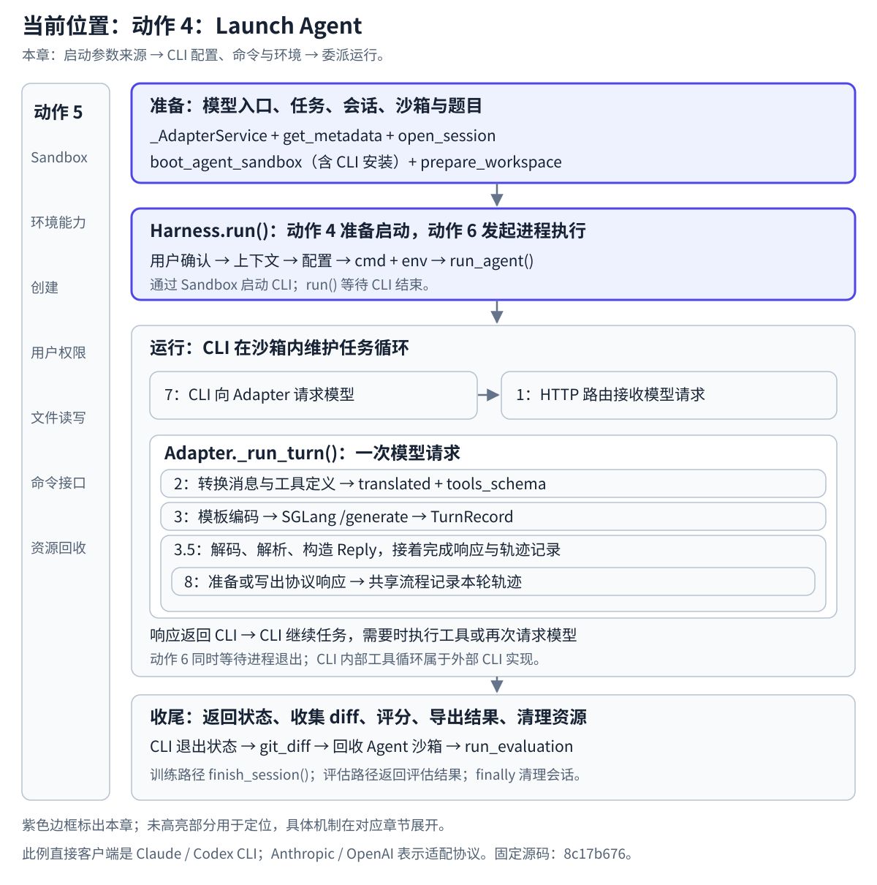
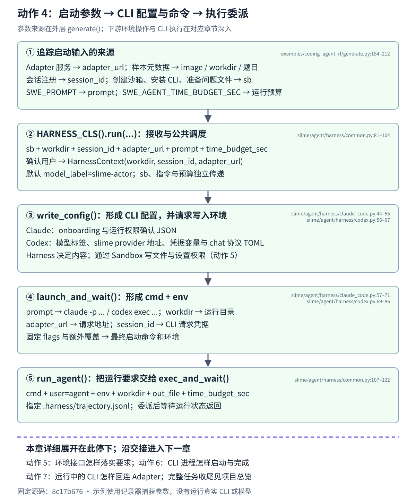

# Launch Agent：参数来源到 CLI 启动的纵向数据流

## 先看源码阅读路线

源码目录：`/home/hongshi/projects/slime/`。下面列出完整文件路径；点击链接可查看固定版本 `8c17b676` 的函数入口。

```text
generate.py：找到 HARNESS_CLS().run(...)
  → common.py：读 BaseHarness.run()
  → claude_code.py 或 codex.py：读配置与启动命令
  → common.py：读 run_agent() 的执行委派
```

1. [examples/coding_agent_rl/generate.py:205](https://github.com/dextermayhewjd/slime/blob/8c17b676cb57af1d17ee4402e91e9209af84b60b/examples/coding_agent_rl/generate.py#L205)：找到 `HARNESS_CLS().run(...)`，向上看启动参数怎样准备。
2. [slime/agent/harness/common.py:81](https://github.com/dextermayhewjd/slime/blob/8c17b676cb57af1d17ee4402e91e9209af84b60b/slime/agent/harness/common.py#L81)：读 `BaseHarness.run()`，看用户准备、上下文、写配置和启动等待的顺序。
3. 选择 [slime/agent/harness/claude_code.py:44](https://github.com/dextermayhewjd/slime/blob/8c17b676cb57af1d17ee4402e91e9209af84b60b/slime/agent/harness/claude_code.py#L44) 或 [slime/agent/harness/codex.py:56](https://github.com/dextermayhewjd/slime/blob/8c17b676cb57af1d17ee4402e91e9209af84b60b/slime/agent/harness/codex.py#L56)：先读 `write_config()`，接着读 `launch_and_wait()`，看配置、命令和环境变量怎样形成。
4. 回到 [slime/agent/harness/common.py:107](https://github.com/dextermayhewjd/slime/blob/8c17b676cb57af1d17ee4402e91e9209af84b60b/slime/agent/harness/common.py#L107)：读 `run_agent()`，看它怎样把执行要求交给 `exec_and_wait()`。

## 在任务生命周期中的位置

本章：启动参数来源 → CLI 配置、命令与环境 → 委派运行。

[](../../../../../static/images/slime-lifecycle/action-4.svg)

[返回生命周期总览](../../README.md#任务生命周期与原图的用途) · [放大当前位置图](../../../../../static/images/slime-lifecycle/action-4.svg)

**沿一个样本追踪：任务、模型入口和会话怎样准备，怎样交给 Harness，又怎样成为 CLI 的配置、指令与请求身份。** `HARNESS_CLS().run(...)` 是中间的交接点。前面的动作 2、3、3.5 位于 CLI 启动后发起的一次模型请求中；本篇回到启动这次任务的外层。

[返回动作 4](../README.md) · [返回原架构图](../../README.md) · [图文预览](index.html) · [完整示例](示例.json) · [放大流程图](flow.svg)

[](flow.svg)

下面的局部图聚焦启动参数、配置与命令的形成，以及向执行接口的委派。点击流程图可以放大阅读。

本篇按源码正常路径展开。地址、目录和会话 ID 使用现有示例的教学值：`/workspace/demo`、`cagent-demo-0-0`、`http://192.0.2.10:18001`、`1800` 秒。它们不是某次真实部署的记录。

## 1 外层入口：选择 Agent，建立模型入口，读取任务

外层入口是 `examples/coding_agent_rl/generate.py:182` 的 `generate(args, base_sample, sampling_params, evaluation=False)`。本篇从这个入口开始追踪输入；它上游的数据集加载与 rollout 调度不在这里展开。

| 输入 | 在这次启动中的用途 |
| --- | --- |
| `args` | 提供 tokenizer 检查点、SGLang Router 地址和上下文设置等 |
| `base_sample` | 提供任务元数据、题目与样本身份 |
| `sampling_params` | 作为这次会话的默认生成设置，保存到 Adapter |
| `evaluation` | 决定采用训练还是评估的数据协议 |
| 环境变量 | 提供 Agent 选择、Adapter 对外地址、运行预算、CLI 安装包与额外启动设置等 |

模块加载时，`SWE_AGENT` 选择一对组件（`generate.py:45–52`）：

```text
claude_code → ClaudeCodeHarness + AnthropicAdapter
codex       → CodexHarness      + OpenAIAdapter
```

进入 `generate()` 后，先执行以下源码（`generate.py:184–187`）：

```python
state = _AdapterService(args)
protocol = CONFIG.eval_protocol if evaluation else CONFIG.train_protocol
md = swe.get_metadata(base_sample, protocol)
instance_id = md["instance_id"]
```

这里形成两路数据：

| 数据路 | 怎样形成 | 后续交给谁 |
| --- | --- | --- |
| 模型入口 | `_AdapterService` 创建配套 Adapter 并启动 HTTP 服务；以 `ADAPTER_PUBLIC_HOST` 和实际监听端口组合 `state.adapter_url` | Harness 将地址写入 CLI 配置或进程环境 |
| 任务信息 | `swe.get_metadata()` 按协议提取 `image`、`workdir`、`problem_statement`、`instance_id` 等 | 创建沙箱、准备工作区、产生会话 ID |

Adapter 的对外地址用于沙箱中的 CLI 回连；`ADAPTER_BIND_HOST` 是服务监听地址。Adapter 请求 SGLang 的地址另由 `args.sglang_router_ip` 与 `args.sglang_router_port` 组合。CLI 连接 Adapter，Adapter 再连接 SGLang。

源码位置：`generate.py:137–171`；任务解析在 `examples/coding_agent_rl/swe.py:77–137`。Adapter 服务由共享对象管理，不需要为每次模型请求重新启动。外层还会检查任务是否有镜像和目录、是否可评估，检查通过后才继续启动。

## 2 会话：把任务身份与采样设置先存入 Adapter

模型入口建立后，外层生成会话 ID，并在 Adapter 注册（`generate.py:194–199`）：

```python
session_id = base_sample.session_id = _session_id(base_sample, instance_id)
state.adapter.open_session(
    session_id,
    sampling_defaults=sampling_params,
    max_context_tokens=state.max_context_len,
)
```

`_session_id()`（`generate.py:308–313`）优先复用样本已有 ID；否则用任务 ID、样本索引和分组索引构造，索引不全时使用随机后缀。教学值 `cagent-demo-0-0` 对应任务 `demo` 与两个索引 `0`。

`open_session()` 将默认采样设置与上下文限制保存到 `adapter.store[session_id]`。**采样设置留在 Adapter；同一个 `session_id` 将继续交给 Harness，再进入 CLI 的请求凭据。** 后续 `_run_turn()` 识别请求的会话 ID，从会话存储取出相应状态供生成步骤使用。

```text
sampling_params → Adapter 会话中的 sampling_defaults
session_id      → Harness → CLI 请求凭据 → Adapter 找到同一会话
```

源码位置：`slime/agent/adapters/common.py:210–223`、`:327–336`。具体采样参数合并与生成请求沿动作 3 展开。

## 3 执行环境与题目：获得 sb，安装 CLI，准备问题文件

外层接着执行（`generate.py:203–204`）：

```python
async with boot_agent_sandbox(md["image"], instance_id) as sb:
    await swe.prepare_workspace(sb, md["workdir"], md)
```

`boot_agent_sandbox()` 以任务镜像创建 E2B 沙箱，并在返回 `sb` 前调用 `HARNESS_CLS().install_cli(cand)` 安装所选 CLI。安装时使用的 Node 与 CLI 安装包路径由相应 `SLIME_AGENT_*` 环境变量提供。沙箱创建、重试与回收的实现沿动作 5 展开。

`prepare_workspace()` 确认用户与权限、运行需要的任务准备命令，随后写入（`swe.py:194–198`）：

```python
await sb.write_file(
    f"{workdir}/PROBLEM_STATEMENT.md",
    md.get("problem_statement") or "",
    user="agent",
)
```

因此 CLI 得到题目的路径分成两条：

| 内容 | 来源 | 交付方式 |
| --- | --- | --- |
| 本样本的具体题目 | `md["problem_statement"]`，按协议从元数据或样本 prompt 中提取 | 写入工作目录的 `PROBLEM_STATEMENT.md` |
| 启动指令 | `swe.SWE_PROMPT`，可由 `SWE_CC_PROMPT` 覆盖 | 作为 `run(prompt=...)` 的参数，随后成为 CLI 命令参数 |

默认启动指令要求读取问题文件、修改源码并验证。**问题正文通过文件交付，启动指令告诉 CLI 读取这个文件并工作。** `run()` 开始前，沙箱、CLI 安装和问题文件都已经准备完毕。

## 4 启动交接：六项输入怎样进入 run

调用点为 `generate.py:205–212`，原样摘录：

```python
agent_exit_code = await HARNESS_CLS().run(
    sb,
    workdir=md["workdir"],
    session_id=session_id,
    adapter_url=state.adapter_url,
    time_budget_sec=CONFIG.agent_time_budget_sec,
    prompt=swe.SWE_PROMPT,
)
```

| 输入 | 前面已经追踪的来源 | Harness 中的去向 |
| --- | --- | --- |
| `sb` | 第 3 节获得的执行环境对象 | 用户准备、配置写入与执行接口 |
| `workdir` | 第 1 节解析的任务元数据 | 上下文与 CLI 运行目录 |
| `session_id` | 第 2 节产生并注册的会话 | 上下文与请求身份 |
| `adapter_url` | 第 1 节建立的模型入口 | 上下文与 CLI 的请求地址 |
| `time_budget_sec` | `SWE_AGENT_TIME_BUDGET_SEC`，默认 `1800`（`generate.py:71`） | CLI 运行等待预算 |
| `prompt` | 第 3 节的启动指令 | CLI 命令参数 |

公共 `BaseHarness.run()` 的主体为（`slime/agent/harness/common.py:97–104`）：

```python
await _sandbox.ensure_agent_user(sb, workdir)
ctx = HarnessContext(
    workdir=workdir,
    session_id=session_id,
    adapter_url=adapter_url,
)
await self.write_config(sb, ctx)
return await self.launch_and_wait(sb, ctx, prompt, time_budget_sec)
```

用户准备在工作区准备时已经做过；这里再次确认，便于 Harness 独立使用。上下文保留目录、会话和入口，并带有默认 `model_label="slime-actor"`；`sb`、指令与预算继续独立传递。这个模型标签用于 CLI 配置，实际生成模型由上游 SGLang 加载的模型决定。

## 5 Harness 转换：启动上下文怎样变成配置、cmd 与 env

`run()` 接下来的两步由所选子类实现：`write_config()` 准备配置，`launch_and_wait()` 形成命令与环境，再委派运行。

| 产物 | Claude Code 分支 | Codex 分支 |
| --- | --- | --- |
| 配置文件 | `/home/agent/.claude.json` 与 `.claude/settings.json`，设置 onboarding 与运行权限确认 | `/home/agent/.codex/config.toml`，指定模型标签、slime provider 地址、凭据变量与 chat 协议 |
| CLI 命令 | `/usr/local/bin/claude -p {引用后的 prompt}` 加固定 flags | `codex exec --skip-git-repo-check {引用后的 prompt}` |
| 模型入口 | `ANTHROPIC_BASE_URL=ctx.adapter_url` | TOML 中的 `base_url`，以及 `OPENAI_BASE_URL=ctx.adapter_url + "/v1"` |
| 请求身份 | `ANTHROPIC_AUTH_TOKEN=ctx.session_id` | `OPENAI_API_KEY=ctx.session_id` |

以 Claude 分支的教学值为例，关键映射结果为：

```text
运行目录：/workspace/demo
启动指令：读取该目录的 PROBLEM_STATEMENT.md 并解决问题
ANTHROPIC_BASE_URL=http://192.0.2.10:18001
ANTHROPIC_AUTH_TOKEN=cagent-demo-0-0
ANTHROPIC_MODEL=slime-actor
```

至此，两条模型连接都落实了：**地址决定 CLI 请求哪个 Adapter；请求凭据携带会话标识，让 Adapter 关联第 2 节保存的状态。** 这里的会话标识用于此训练链路的请求关联。

源码位置：`slime/agent/harness/claude_code.py:44–71`、`slime/agent/harness/codex.py:56–86`。两种分支还支持相应 `*_EXTRA_ARGS` 追加命令参数、`*_EXTRA_ENVS` 最后覆盖环境；现有示例使用空覆盖，完整固定 flags 和捕获值见[示例.json](示例.json) 的 `branches`。

## 6 向 Sandbox 委派：从启动要求到进程执行

两种 Harness 都把工作目录、`cmd`、`env` 和预算交给 `run_agent()`。它先请求创建日志目录，再调用 `exec_and_wait()`（`slime/agent/harness/common.py:107–122`）。Claude 教学分支的主要交接值是：

```text
cmd             = /usr/local/bin/claude -p ...
user            = agent
env             = 第 5 节形成的环境变量
workdir         = /workspace/demo
out_file        = /workspace/demo/.harness/trajectory.jsonl
time_budget_sec = 1800
tag             = run
want_output     = False
```

这是完整示例中的 `exec_and_wait_input`。日志文件用于接收 CLI 进程输出；模型 token 与训练轨迹由 Adapter 的会话流程另行保存。

**本章在运行要求交出时停下。** [动作 5 Manage Sandbox](<../../5.Manage Sandbox/README.md>)从前面的用户、配置和日志目录等沙箱调用处深入环境接口；[动作 6 Exec Commands](<../../6.Exec Commands/README.md>)继续解释启动脚本、后台进程、输出与完成等待。CLI 运行后的模型请求沿[动作 7 Make API Calls](<../../7.Make API Calls/README.md>)进入 Adapter。

## 7 返回契约与任务总览

`run()` 使用 `await` 等待下游运行结束，最终返回整数运行状态，外层以 `agent_exit_code` 接收。这个等待覆盖整次 CLI 运行；其间 CLI 可以请求模型，但不是 Harness 直接调用 `_run_turn()`。

收集 diff、评分、导出结果与清理资源由外层 `generate()` 组织，位置见[任务生命周期总览](../../README.md#任务生命周期与原图的用途)。本章保留返回契约，具体完成等待机制在动作 6 深入。

## 源码与示例边界

固定源码：`8c17b676cb57af1d17ee4402e91e9209af84b60b`。路径均相对于 Slime 仓库根目录。

上游参数准备按固定源码静态追踪。现有[示例.json](示例.json)从六项启动输入开始：先前已执行源代码摘录中的公共 `run()`、两种 Harness 的配置与启动参数计算及 `run_agent()`，沙箱操作使用记录器，`exec_and_wait()`使用参数捕获与模拟返回，单例元类以普通 ABC 元类替代。

示例中的 `simulated_exit_code` 是记录器返回值；HTTP 请求头也是教学示意。它没有运行外层 `generate()`、真实沙箱、CLI、HTTP 请求或模型。本次文档更新保留捕获数据，聚焦其输入来源、参数转换与委派边界。
