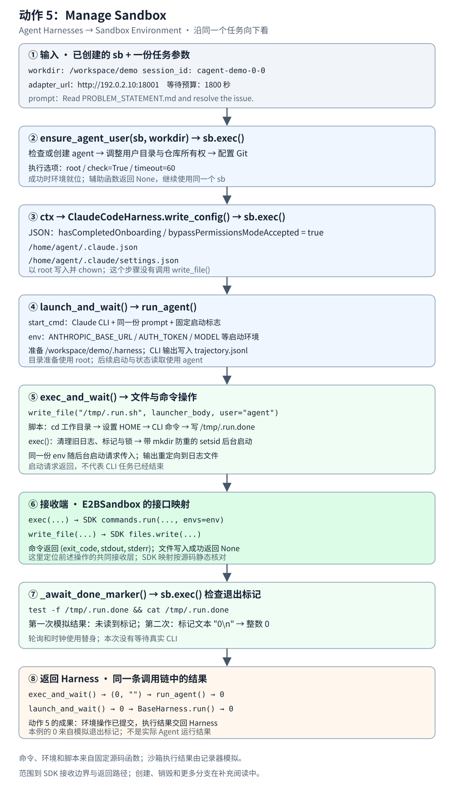

# Manage Sandbox 纵向数据流



[返回动作 5](../README.md) · [打开图文预览](index.html)

这张局部图只展开 **Agent Harnesses → Sandbox Environment** 的动作 5。顺着图向下看，下面所有参数、命令和文件内容都来自[同一个完整示例](示例.json)。

本例选择 `ClaudeCodeHarness`，手里已经有创建好的 `sb` 和准备好的工作目录。Harness 逐步把用户准备、配置写入和运行命令交给沙箱接口。**命令与文件内容由固定版本的真实函数生成；沙箱执行结果由记录器模拟。**

图上的顺序表示本例的真实调用顺序。对执行环境的修改通过 `sb.exec()` / `sb.write_file()` 提交；E2B 实现怎样接收这些操作在第 6 步单独定位。

## 1. 入口：手里已经有 sb 和一份任务参数

`BaseHarness.run()` 接收沙箱对象 `sb`，以及以下字段。

<details>
<summary>展开完整输入：下面各步骤一直使用这一份参数</summary>

```json
{
  "workdir": "/workspace/demo",
  "session_id": "cagent-demo-0-0",
  "adapter_url": "http://192.0.2.10:18001",
  "time_budget_sec": 1800,
  "prompt": "Read PROBLEM_STATEMENT.md and resolve the issue."
}
```

</details>

| 输入 | 后面用在哪里 |
| --- | --- |
| `sb` | 同一个沙箱对象，供用户准备、配置写入与运行辅助函数使用 |
| `workdir` | 调整目录所有权；指定 CLI 工作目录和日志位置 |
| `adapter_url`、`session_id` | 在 CLI 启动时放入环境变量 |
| `prompt` | 组成 CLI 的启动命令 |
| `time_budget_sec` | 用于等待退出标记 |

`sb` 是操作对象，没有把它伪装成 JSON 字段。上面的地址与目录是教学值。创建沙箱和安装 CLI 已由外层完成；这次从 Harness 使用环境的入口开始。

## 2. 用户准备：ensure_agent_user() → sb.exec()

它收到的是 **同一个 `sb` 和 `workdir="/workspace/demo"`**。生成的完整命令为：

```bash
id agent >/dev/null 2>&1 || useradd -m -s /bin/bash agent && chown -R agent:agent /home/agent /workspace/demo && git config --system --add safe.directory '*' && id agent
```

交给沙箱接口的执行选项：

```json
{
  "user": "root",
  "timeout": 60,
  "check": true
}
```

| 子操作 | 成功时环境中的成果 |
| --- | --- |
| `id agent`，不存在时 `useradd` | 确认沙箱中的 `agent` 用户存在 |
| `chown -R` | 让 `agent` 拥有用户目录和工作目录 |
| 设置 Git safe.directory，最后再执行 `id agent` | 准备 Git 访问并检查用户状态 |

`sb.exec()` 返回三元组。记录器在这一步模拟返回 `(0, "", "")`；辅助函数不使用 stdout/stderr，返回 `None`。**该步骤的主要成果是沙箱中的用户与权限就位；本次记录器没有实际修改这些状态。**

## 3. 配置准备：ctx → write_config() → sb.exec()

用户准备返回后，`BaseHarness.run()` 从原输入中取出三项，构造上下文：

```json
{
  "workdir": "/workspace/demo",
  "session_id": "cagent-demo-0-0",
  "adapter_url": "http://192.0.2.10:18001",
  "model_label": "slime-actor"
}
```

`model_label` 来自默认值。随后 `ClaudeCodeHarness.write_config(sb, ctx)` 准备这一份 JSON：

```json
{
  "hasCompletedOnboarding": true,
  "bypassPermissionsModeAccepted": true
}
```

实际提交给 `sb.exec()` 的完整命令：

```bash
mkdir -p /home/agent/.claude && echo '{"hasCompletedOnboarding": true, "bypassPermissionsModeAccepted": true}' | tee /home/agent/.claude.json /home/agent/.claude/settings.json > /dev/null && chown -R agent:agent /home/agent/.claude /home/agent/.claude.json
```

| 输入或选项 | 输出或副作用 |
| --- | --- |
| 配置 JSON | 写入 `/home/agent/.claude.json` 和 `/home/agent/.claude/settings.json` |
| `user="root"`、`check=True`、`timeout=60` | 以 root 准备目录、写文件并调整所有权 |
| 模拟成功的执行结果 | `write_config()` 返回 `None`，公共流程继续 |

**这里通过 shell 命令写配置。**这个步骤没有调用 `sb.write_file()`，两个文件内容相同。对于该 Claude 分支，模型地址与会话 ID 稍后进入启动环境变量。

## 4. 运行准备：命令和环境 → run_agent()

`launch_and_wait()` 收到 `sb + ctx + prompt + time_budget_sec`。它从同一份参数组成 CLI 命令与环境，交给公共 `run_agent()`：

```json
{
  "workdir": "/workspace/demo",
  "start_cmd": "/usr/local/bin/claude -p 'Read PROBLEM_STATEMENT.md and resolve the issue.' --permission-mode bypassPermissions --output-format stream-json --include-partial-messages --include-hook-events --verbose",
  "env": {
    "ANTHROPIC_BASE_URL": "http://192.0.2.10:18001",
    "ANTHROPIC_AUTH_TOKEN": "cagent-demo-0-0",
    "ANTHROPIC_MODEL": "slime-actor",
    "CLAUDE_CODE_DISABLE_NONESSENTIAL_TRAFFIC": "1",
    "CLAUDE_CODE_DISABLE_EXPERIMENTAL_BETAS": "1",
    "CLAUDE_CODE_ATTRIBUTION_HEADER": "0"
  },
  "time_budget_sec": 1800
}
```

本例没有额外参数或环境覆盖。`prompt` 已用 shell 引号处理，`workdir` 和等待预算保持原值。

`run_agent()` 先向同一个沙箱提交日志目录准备命令：

```bash
mkdir -p /workspace/demo/.harness && chown agent:agent /workspace/demo/.harness
```

这一条仍以 `root` 执行，`timeout=30`、`check=True`。接着把 CLI 命令交给 `exec_and_wait()`，指定 **`user="agent"`、`tag="run"`、`want_output=False`**，日志路径为 `/workspace/demo/.harness/trajectory.jsonl`。

日志保存 CLI 的 stdout/stderr；这里没有展开 CLI 内部执行工具和请求模型的循环。

## 5. 文件与启动操作：exec_and_wait() → Sandbox

### 5.1 输入命令 → 启动脚本

`exec_and_wait()` 把原来的 `workdir`、用户和命令放进脚本。实际交给 `sb.write_file()` 的路径与用户是：

```json
{
  "sandbox_path": "/tmp/.run.sh",
  "user": "agent"
}
```

完整文件内容：

```bash
#!/bin/bash
cd /workspace/demo
export HOME=/home/agent
/usr/local/bin/claude -p 'Read PROBLEM_STATEMENT.md and resolve the issue.' --permission-mode bypassPermissions --output-format stream-json --include-partial-messages --include-hook-events --verbose
echo $? > /tmp/.run.done
```

成功时 `write_file()` 返回 `None`。脚本在 CLI 命令之后，把它的退出码写入 `/tmp/.run.done`。其中 `HOME` 是现有源码在沙箱脚本中设置的进程环境。

### 5.2 清理旧状态 → 提交后台启动

先用单独一次 `sb.exec()` 清理本次 tag 的旧状态：

```bash
rm -rf /tmp/.run.spawned; rm -f /workspace/demo/.harness/trajectory.jsonl /tmp/.run.done
```

再用下一次 `sb.exec()` 启动：

```bash
chmod +x /tmp/.run.sh; mkdir /tmp/.run.spawned 2>/dev/null || exit 0; setsid bash /tmp/.run.sh < /dev/null > /workspace/demo/.harness/trajectory.jsonl 2>&1 &
```

| 启动输入 | 接口实际接收的值 |
| --- | --- |
| `user` | `agent` |
| `env` | 第 4 步展示的完整环境变量字典 |
| `timeout` | `30`，限制这次启动命令请求 |
| `check`、`idempotent` | 均为 `True` |

`mkdir /tmp/.run.spawned` 是同一次启动 RPC 的重放防护。锁目录已经存在时，这条命令提前退出。不同逻辑调用会先清理旧状态；同一沙箱里不能并发使用相同 tag。

**启动这条 shell 命令结束后，CLI 任务仍可能在后台运行。**退出标记用于后面的等待。

## 6. 接收端：E2BSandbox 把操作交给 SDK

前面各步调用的是 `Sandbox` 接口。本例的实际后端若为 `E2BSandbox`，它会作以下交接；这一节按源码静态对应，没有连接 E2B。

| 收到的操作 | 下层接收点 | 回给调用方什么 |
| --- | --- | --- |
| `sb.exec(cmd, user=..., env=..., timeout=...)` | `self._sb.commands.run(cmd, user=user, envs=env, timeout=timeout, ...)` | `(exit_code, stdout, stderr)` |
| `sb.write_file(path, launcher_body, user="agent")` | `self._sb.files.write(path, launcher_body, user="agent")` | 成功返回 `None`，脚本写入沙箱 |

以第 5.2 步的启动操作为例，**`cmd` 保持原字符串，`env` 改用 SDK 的参数名 `envs`**。`check` 和 `idempotent` 留在 Slime 包装层处理，不作为这次 SDK 命令的参数。

`E2BSandbox.exec()` 成功时将 SDK 结果整理成：

```python
(res.exit_code, res.stdout or "", res.stderr or "")
```

这就是图中的 Harness → Sandbox 交接：调用方提供环境操作，接收方执行对应的 SDK 调用并返回结果。远端网关和 CLI 本体到这里作为外部边界。

## 7. 等待与返回：退出标记 → Harness 的整数结果

`_await_done_marker()` 继续通过同一个 `sb.exec()` 检查：

```bash
test -f /tmp/.run.done && cat /tmp/.run.done
```

每次检查使用 `user="agent"`、`timeout=15`、`check=False`。本例记录器模拟两次检查：

| 检查 | `sb.exec()` 的模拟返回 | 等待函数怎样处理 |
| --- | --- | --- |
| 第一次 | `(1, "", "")` | 没有读到标记，继续等待 |
| 第二次 | `(0, "0\n", "")` | 将标记内容转成整数 `0`，返回 |

这两次检查间隔由替身时钟模拟，没有真的等待或运行 CLI。返回值继续沿原来的调用链交回：

```text
_await_done_marker() -> 0
exec_and_wait()      -> (0, "")
run_agent()          -> 0
launch_and_wait()    -> 0
BaseHarness.run()   -> 0
```

`want_output=False` 且退出码为 `0` 时，`exec_and_wait()` 返回空输出，不读日志。**此处的 `0` 是记录器提供的示例结果，用于核对返回路径；不是这次真实 Agent 运行成功的证据。**

## 8. 动作 5 到这里结束

同一个 `sb` 接收了用户准备、配置、目录、启动脚本、后台启动和状态读取操作。Harness 最后收到一个整数退出码。模型输入转换、训练轨迹和任务评分都没有混入这条局部链。

创建与销毁由外层上下文管理，按需补看[创建入口和生命周期](../3.创建入口和生命周期.md)。读懂本图的操作与返回之后，再展开这些边界。

<details>
<summary>已经理解数据流后：源码位置与进一步校验</summary>

固定源码版本：`8c17b676cb57af1d17ee4402e91e9209af84b60b`。路径均相对于 Slime 仓库根目录。

| 要校验的事实 | 定义 / 调用位置 |
| --- | --- |
| 公共入口接收已有沙箱 | `slime/agent/harness/common.py:81` |
| 先准备用户，再构造上下文、写配置、启动等待 | `slime/agent/harness/common.py:97`–`:104` |
| 用户准备生成命令 | `slime/agent/sandbox.py:390`、`:392` |
| Claude 配置内容与沙箱写入命令 | `slime/agent/harness/claude_code.py:44`–`:55` |
| 命令与环境传给 runner | `slime/agent/harness/claude_code.py:57`–`:71` |
| 日志目录准备与长命令调用 | `slime/agent/harness/common.py:107`、`:110`、`:111` |
| 启动脚本内容与写入 | `slime/agent/sandbox.py:107`–`:113` |
| 清理旧状态与后台启动 | `slime/agent/sandbox.py:122`、`:129` |
| 检查并读取退出标记 | `slime/agent/sandbox.py:65`、`:76` |
| E2B 命令接口与成功返回 | `slime/agent/sandbox.py:309`、`:324`、`:334` |
| 文本文件写入 SDK | `slime/agent/sandbox.py:342`、`:377` |
| 等待结果与整数返回 | `slime/agent/sandbox.py:139`–`:145`；`slime/agent/harness/common.py:122` |

**已执行校验：** 从上述 Git blob 提取公共入口、Claude 子类、runner 与长命令辅助函数，替换沙箱为记录器；真实函数生成本例的命令、环境、脚本，并走完模拟两次轮询后的成功返回路径。单例元类替换为普通 ABC 元类，环境覆盖为空；等待与时钟使用替身。

**静态核对：** `E2BSandbox` 的 SDK 参数映射。没有执行 E2B SDK、远端用户或文件修改、CLI、模型请求。示例中的命令返回值都是模拟值。

需要更广的上下文时，可读[动作 5 入口](../README.md)、[命令和文件操作](../1.命令和文件操作.md)、[主路径和源码函数](../2.主路径和源码函数.md)。

</details>
