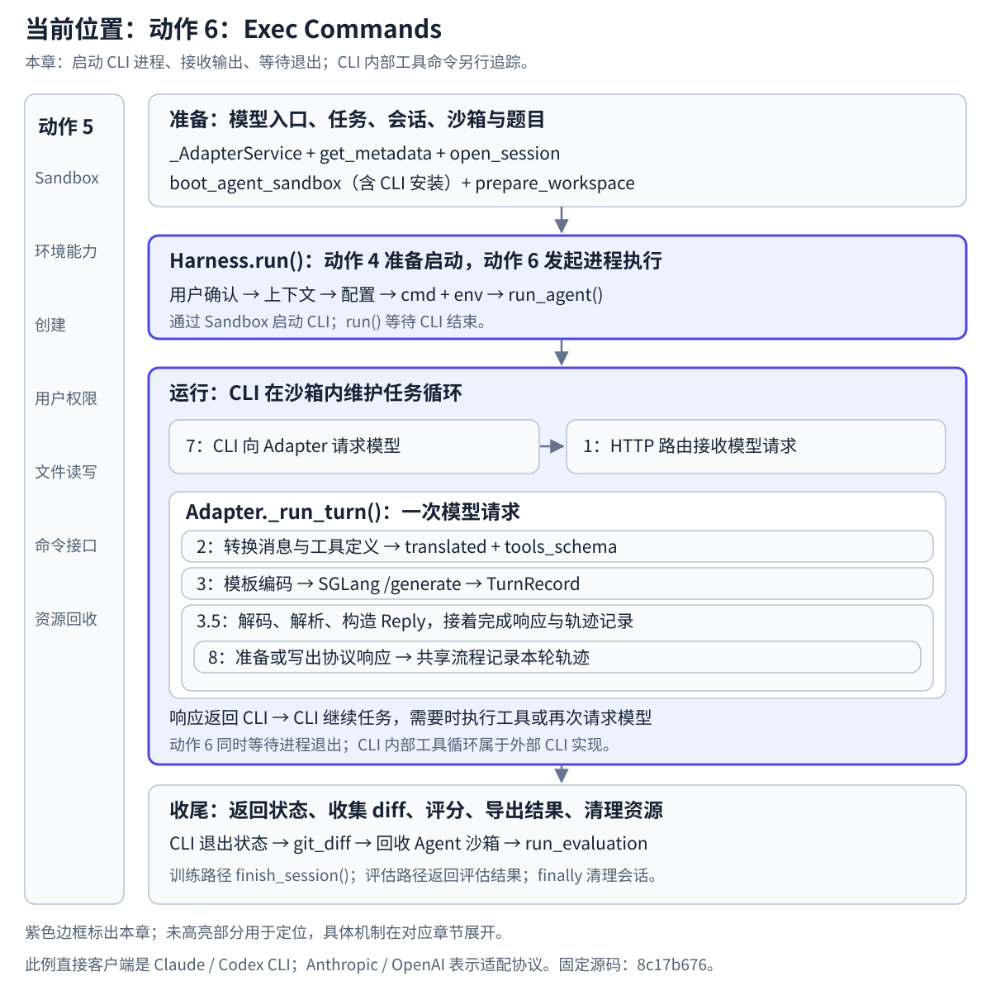

# 动作 6 Exec Commands：启动 CLI 进程并等待完成

## 在任务生命周期中的位置

本章：启动 CLI 进程、接收输出、等待退出；CLI 内部工具命令另行追踪。

[](../../../../static/images/slime-lifecycle/action-6.svg)

[返回生命周期总览](../README.md#任务生命周期与原图的用途) · [放大当前位置图](../../../../static/images/slime-lifecycle/action-6.svg)

**本章接住动作 4 准备好的启动要求，沿 Sandbox 的执行接口，看命令怎样成为 CLI 进程、输出怎样保存、退出状态怎样返回。** 创建沙箱、配置内容与环境文件操作分别在动作 4、5 展开。

## 1 输入与执行成果

调用入口是 `slime/agent/harness/common.py:107–122` 的 `run_agent()`，长命令机制在 `slime/agent/sandbox.py:82–145` 的 `exec_and_wait()`。

| 输入 | 执行期间的用途 |
| --- | --- |
| `sb` | 把文件和命令操作提交给执行环境 |
| `cmd` | 动作 4 形成的 `claude -p ...` 或 `codex exec ...` |
| `user`、`env`、`workdir` | 指定运行身份、模型入口与会话凭据、工作目录 |
| `out_file` | 接收 CLI 的标准输出与错误输出 |
| `time_budget_sec` | 限定等待退出标记的预算 |
| `tag` | 区分启动脚本、退出标记与防重复启动状态 |

运行结果为 `(exit_code, output)`。Harness 的 `run_agent()` 取出退出状态，沿 `launch_and_wait()`、`run()` 返回给外层 `generate()`。

## 2 先看局部执行流程

```text
cmd + 运行参数
  → 写启动脚本：运行 cmd 后把退出码写入 done_file
  → 清理上次调用的状态
  → 通过 Sandbox 提交后台启动命令
  → CLI 进程运行，输出重定向到 out_file
  → 等待端轮询 done_file
  → 得到退出码，按需要读回输出
  → 返回 Harness，再返回 generate()
```

脚本与状态文件的写入使用动作 5 的环境操作能力。本章重点解释这些文件在进程启动和完成等待中起什么作用。

## 3 为什么不一直等待一条远端命令连接

源码注释说明：长任务可能超过 E2B 网关维持单条响应流的时间。因此实现使用后台进程运行命令，以一系列短请求轮询退出标记。命令在远端持续运行，等待端不依赖同一条连接从头保持到尾。

`exec_and_wait()` 根据 `tag` 生成 `launcher`、`done_file`、`lock_dir` 等路径；启动脚本最后执行 `echo $? > done_file`，把 CLI 命令的退出状态保存下来。源码位置：`sandbox.py:107–113`。

## 4 哪一步真正启动进程

沙箱接到以下命令（`sandbox.py:129–138`，原样摘录）：

```python
await sb.exec(
    f"chmod +x {launcher}; "
    f"mkdir {lock_dir} 2>/dev/null || exit 0; "
    f"setsid bash {launcher} < /dev/null > {out_file} 2>&1 &",
    user=user,
    env=env,
    timeout=30,
    check=True,
    idempotent=True,
)
```

`setsid bash` 在后台启动脚本，脚本再执行 CLI 命令；输出进入 `out_file`。防重复目录用于避免同一次启动在传输重试时重复执行。新的一次逻辑调用会先清理旧状态；相同 `tag` 的调用不能同时重叠。

`E2BSandbox.exec()` 通过 SDK `commands.run()` 提交这条 shell 命令（`sandbox.py:309–340`）。SDK 和远端进程创建属于外部实现，本仓库能追踪到这里的提交与返回边界。

## 5 CLI 运行与等待同时存在

外层等待 `_await_done_marker()` 时，CLI 已在沙箱里工作；它可以读取题目、向 Adapter 请求模型、根据结果执行工具并继续任务。模型请求沿[动作 7 Make API Calls](<../7.Make API Calls/README.md>)进入 Adapter。

**这里启动的是整个 Agent CLI 进程。** CLI 后续因模型工具调用执行 shell 命令或编辑文件，属于 CLI 内部实现，不是再次调用这条 Slime 启动链。本地 Slime 源码没有包含 CLI 的完整工具循环。

等待端每隔 5 秒检查退出标记。读到标记时返回其中的退出码；等待预算耗尽时返回 `EXIT_TIME_BUDGET_EXCEEDED = -1`（`sandbox.py:62–79`）。这一函数本身没有在返回 `-1` 时执行进程终止；外层离开 Agent 沙箱上下文时回收沙箱。

## 6 输出与退出状态怎样交回

`exec_and_wait()` 在成功且 `want_output=False` 时返回 `(0, "")`；需要完整输出时读回文件，否则在非成功状态下取输出尾部作为诊断。

本例 Harness 指定 `out_file=workdir + "/.harness/trajectory.jsonl"`、`want_output=False`。该文件接收 CLI 进程输出；模型 token 与训练轨迹由 Adapter 的会话流程保存。

正常路径回到 `generate()` 后，外层收集代码 diff、评分，并根据训练或评估模式返回结果。任务收尾的整体位置见项目生命周期总览。

## 本章的交接与源码边界

- 上游：[动作 4](<../4.Launch Agent/README.md>)解释配置、启动命令与环境变量怎样形成。
- 环境接口：[动作 5](<../5.Manage Sandbox/README.md>)解释 Sandbox 怎样读写文件、提交命令和处理远端返回。
- 下游：[动作 7](<../7.Make API Calls/README.md>)解释运行中的 CLI 怎样请求模型。
- 返回值：CLI 运行状态经 Harness 返回给外层 `generate()`。

固定源码：`8c17b676cb57af1d17ee4402e91e9209af84b60b`。本篇为静态源码追踪，没有连接 E2B、运行 CLI 或请求模型。
