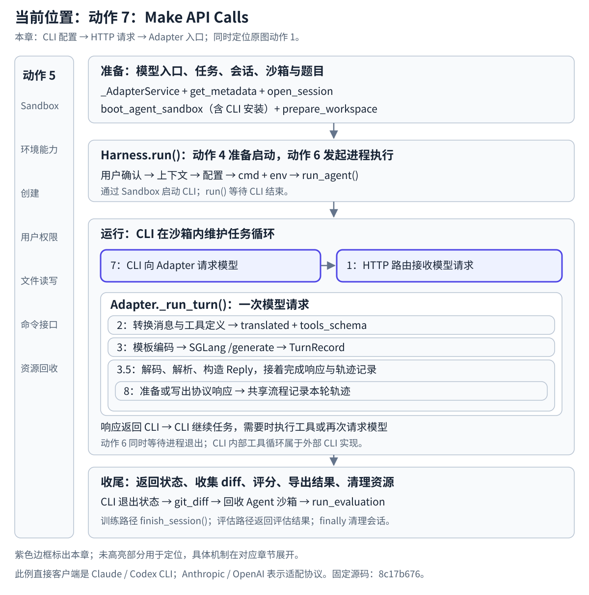

# 动作 7 Make API Calls：CLI 回连 Adapter

## 在任务生命周期中的位置

本章：CLI 配置 → HTTP 请求 → Adapter 入口；同时定位原图动作 1。

[](../../../../static/images/slime-lifecycle/action-7.svg)

[返回生命周期总览](../README.md#任务生命周期与原图的用途) · [放大当前位置图](../../../../static/images/slime-lifecycle/action-7.svg)

**本章解释运行中的 CLI 怎样连接到 Slime 的模型入口：启动配置决定请求地址与会话身份，HTTP 路由把请求交给共享的 `_run_turn()`。** 输入转换、模型生成、响应与轨迹记录分别在动作 2、3、3.5 深入。

## 1 先认清请求的两端

在这个 coding-agent 示例中，请求方是沙箱内的 Claude Code / Codex CLI，接收方是外层 `generate()` 准备的 Adapter 服务。Claude Code 使用 Anthropic Messages 形状，Codex 使用本版本配置的 OpenAI Chat Completions 形状。

原 CodeWiki 图里的 `External Platforms (Anthropic, OpenAI, etc.)` 没有对应一个独立的本地组件。在本例中，直接客户端是 CLI；Anthropic / OpenAI 表示接口协议，实际模型生成交给 Slime 的 SGLang 后端。原图动作 1 表示接收客户端请求，动作 7 标明请求来自运行中的 CLI；它们连接的是同一次请求的客户端与接收端。

## 2 地址与会话身份从哪里来

| Harness | 请求地址的设置 | 会话身份的设置 | 配套 Adapter 路由 |
| --- | --- | --- | --- |
| Claude Code | `ANTHROPIC_BASE_URL=ctx.adapter_url` | `ANTHROPIC_AUTH_TOKEN=ctx.session_id` | `POST /v1/messages` |
| Codex | TOML provider 的 `base_url=ctx.adapter_url + "/v1"`；同时设置 `OPENAI_BASE_URL` | `OPENAI_API_KEY=ctx.session_id` | `POST /v1/chat/completions` |

这些设置由[动作 4 Launch Agent](<../4.Launch Agent/README.md>)形成，由动作 6 传给运行中的 CLI。会话 ID 已在外层 `adapter.open_session()` 注册，默认采样设置留在 Adapter 会话里。

Claude 分支的环境字典原样摘录自 `slime/agent/harness/claude_code.py:62–67`：

```python
env = {
    "ANTHROPIC_BASE_URL": ctx.adapter_url,
    "ANTHROPIC_AUTH_TOKEN": ctx.session_id,
    "ANTHROPIC_MODEL": ctx.model_label,
    **self.static_env,
}
```

地址、凭据与会话的映射可以在本地源码核对；CLI 如何组织完整请求 body、维护消息历史与执行工具，由外部安装包实现。本章不会把这一段推测成 Slime 内部函数调用。

## 3 HTTP 路由怎样进入共享流程

Anthropic Adapter 原样注册路由（`slime/agent/adapters/anthropic.py:49`）：

```python
app.router.add_post("/v1/messages", self._run_turn)
```

OpenAI Adapter 对应注册（`slime/agent/adapters/openai.py:48`）：

```python
app.router.add_post("/v1/chat/completions", self._run_turn)
```

正常请求进入共享 `BaseAdapter._run_turn()`，先读取 JSON、预处理，并解析请求的会话身份。Anthropic 分支优先读取 Bearer 请求头，再读取 `X-Api-Key`；OpenAI 分支优先读取 Bearer 请求头，再读取 body 中的 `metadata.session_id` 或 `user`。

来源：`anthropic.py:192–195`、`openai.py:287–290`、`adapters/common.py:318–344`。外层的会话默认设置由这个 ID 关联到本次请求。

## 4 交给下一章的是什么

```text
CLI 按配置发出模型请求
  → Adapter HTTP 路由
  → _run_turn() 读取 body、解析会话、检查请求门禁
  → _translate(body)                         [动作 2]
  → 编码与 SGLang 生成                       [动作 3]
  → 响应返回与本轮轨迹记录                    [3.5，含原图动作 8]
CLI 根据响应继续任务，可能再次请求
```

动作 7 的交接成果是：**HTTP 请求已经找到处理入口，共享流程持有请求 `body` 与会话状态，准备开始动作 2。** 将消息与工具整理成模型输入属于后续处理。

正常主路径之外，Adapter 还处理关闭会话与轮数限制等门禁；具体请求入口和特殊分支见[动作 2 的补充阅读](<../2.Translate & Forward/3.请求入口和特殊分支.md>)。

## 5 响应返回哪里，是否需要另建一个 External Platforms 阶段

Adapter 将协议响应返回当前 HTTP 请求的客户端，在本例里就是 CLI。客户端继续工作，下一次请求会再次进入 `_run_turn()`。这是一轮请求的返回路径，不是新启动一个外部平台任务。

原图动作 8 的响应形状与流式封装，在[3.5 完成一次模型请求](<../3.5.完成一次模型请求/README.md>)展开；本章只标出返回端。工具执行与 CLI 循环属于外部 CLI 的内部行为。

## 本章的源码边界

固定源码：`8c17b676cb57af1d17ee4402e91e9209af84b60b`。路径相对于 Slime 仓库根目录。本篇静态核对 Harness 的配置映射、Adapter 路由及会话识别，没有运行 CLI、发出 HTTP 请求或运行模型。

继续阅读：[动作 2 Translate & Forward](<../2.Translate & Forward/README.md>) · [动作 3 Generate Tokens](<../3.Generate Tokens/README.md>) · [3.5 完成一次模型请求](<../3.5.完成一次模型请求/README.md>)。
